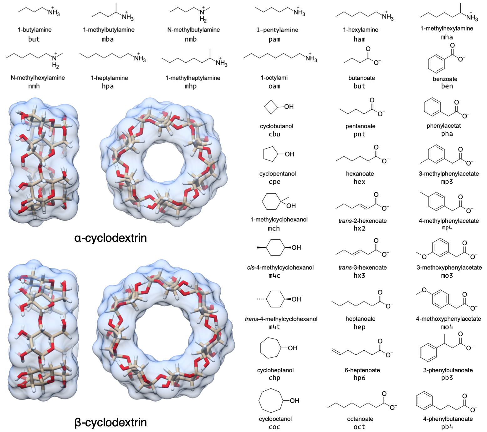

## Introduction

## Methods

### Chose of host-guest system
In this study, we report the binding thermodynamics of 43 host-guest complexes ([@fig:host-guest-pairs]) computed using three different force fields. 
The complexes consist of either α- or β-cyclodextrin as host molecule and a series of ammonium, carboxylate, or cyclic alcohol small molecule guests.
Cyclodextrins are cyclic polymers consisting of six (αCD) or seven (βCD) glucose monomers in the shape of a truncated cone.
The equilibrium constants and standard molar enthalpies of binding for these 43 complexes have been measured using isothermal titration calorimetry [@doi:10.1021/jp962715n] and computationally in [@doi:10.1021/acs.jctc.7b00359].
As in [@doi:10.1021/acs.jctc.7b00359], only a single structural isomer was considered for the 1-methylammonium guests.

{#fig:host-guest-pairs}

### Application of force field parameters

We sought to compare force fields directly, and as such, attempted to minimize additional differences between the simulation sets.
In all simulations, we applied AM1-BCC [@doi:10.1002/jcc.10128; @doi:10/cvvpkv] partial atomic charges to both the host and guest molecules using the `antechamber`program.
The host charges were calculated using a single glucose molecule with methoxy caps on the O1 and O4 alcohols (Figure @fig:atom-names); each glucose monomer in the cyclodextrin polymer has identical charges.
We used TIP3P water [@doi:10.1063/1.445869] and Joung-Cheatham monovalent ion parameters for $\ce{Na+}$ and $\ce{Cl-}$[@doi:10.1021/jp8001614] in each simulation set.

{width=3.5in}
{width=3.5in}

Atom names (left) and GAFF atom types (right) for a glucose monomer in αCD shown with two flanking monomers. The remaining three glucose monomers are hidden for clarity.

GAFF v1.7 bond, angle, torsion, and Lennard-Jones parameters were applied using the `tleap` program distributed with AmberTools16. These simulations were performed as part of Henriksen, et al.  [@doi:10.1021/acs.jctc.7b00359] and are described in additional detail therein.

GAFF v2.1 parameters were applied in an identical manner to the GAFF v1.7 parameters, using the `tleap` program distributed with AmberTools18 and substituting `leaprc.gaff` for `leaprc.gaff2`in the `tleap`input file.
In GAFF v2.1, the bond and angle parameters have been updated to reproduce small molecule geometries obtained from high-level quantum mechanical calculations.
The force constants for the bond and angle parameters were tuned to reproduce the vibrational spectra of over 600 molecules.
The torsion parameters were optimized to reproduce the rotational potential energy surface of 400 model compounds.
Finally, the Lennard-Jones coefficients were redeveloped to reproduce interaction energies and pure liquid properties.
[We might want to cite `gaff2.dat` somehow, because this is where I obtained the above information; we could also cite personal communications with Junmei Wang based on our conversations at the Amber developers' meeting.]{.banner .lightgrey}

To apply SMIRNOFF99Frosst parameters, we followed a [multistep process](https://github.com/slochower/smirnoff-host-guest/blob/master/02-convert-APR-files.ipynb), beginning with the prepared GAFF v1.7 files.
The host and guest molecules were parameterized with the Open Force Field Toolkit version 0.0.3, SMIRNOFF version 1.0, and SMIRNOFF99Frosst version 1.0.5.
Once parameterized with SMIRNOFF99Frosst, ParmEd [@doi:10.1007/s10822-016-9977-1] was used to combine the host and guest with the solvent and ions, which retained their parameters as TIP3P water and Joung-Cheatham ion parameters, respectively.

[I decided to skip a detailed listing of what I did, and instead link to the Jupyter notebook I used, because these instructions may change with future toolkit versions, and in fact, it is already out of date in some ways. If this is a good way to cite this, I can upload that GitHub repository to Zenodo, get a DOI, and cite the DOI. It may also be feasible to include this as SI, but that can get messy for anything other than trivial code listings.]{.banner .lightgrey}

### Thermodynamic calculation
We used the attach-pull-release (APR) method as implemented in the open source package pAPRika version 0.0.3, to calculate absolute binding free energies.
A complete description of the APR method has been characterized in the literature [@doi:10.1021/acs.jctc.5b00405; @doi:10.1002/jcc.23398; @doi:10.1007/s10822-014-9735-1; @doi:10.1021/ct5004109].
The attachment and release phases consisted of 15 independent windows; the pulling phase consisted of 45 independent windows.
During the attachment phase, the force constants on the host and guest are scaled by a $\lambda$ parameter that goes from $\lambda = 0$, when all restraints are turned off, to $\lambda = 1$, when all restraints reach their maximum force constant. The $\lambda$ windows are more densely spaced where the force constant is smaller to improve sampling along highly curved regions of the potential of mean force.
Conformational restraints were applied between neighboring glucose units of the cyclodextrin to limit the incursion of monomers into the host cavity. These restraints were applied along the pseudodihedrals $\ce{{ "{{" }}O5}_n-{C1}_n-{O1}_n-{C4}_{n+1{{ "}}" }}$ and $\ce{{ "{{" }}C1}_n-{O1}_n-{C4}_{n+1}-{C5}_{n+1{{ "}}" }}$ to improve convergence and sampling of the bound state (see Figure \ref{fig:atom-names} for atom naming conventions). To further improve convergence of the bound state, we applied a hard wall restraint that confined the guest molecule to within a sphere of 12.3 and 13.5 Å of αCD and βCD, respectively. 

During the pulling phase, the $\lambda$ parameter represented a distance restraint and is increased uniformly in 45 increments of 0.4 Å, yielding windows that separate the host and guest by 18 Å. An explicit release calculation is performed to turn off the conformational restraints on the host in the absence of guest molecules. This is performed once for each cyclodextrin. An analytic release calculation is performed to compute the work of moving the guest from the restricted volume enforced by the APR restraints to standard state at 1 M concentration. 

[Needs editing]{.banner .lightgrey}

Due to the lack of symmetry of cyclodextrin and the small molecule guests, there are generally two distinct binding poses. We separately compute the binding free energy and enthalpy for each orientation [@doi:10.1021/acs.jctc.5b00405] and combine the results to produce a single value for each host-guest combination.

% For simple guest molecules, with one polar functional group, there are generally two possible binding modes in the CD cavity: one with the polar group oriented out of the CD opening with primary alcohols, and one with the polar group oriented out of the wider opening with secondary alcohols (Figure 2). However, experimental data report binding free energy and enthalpy values based on a Boltzmann-weighted ensemble of these two orientations. In order to compare with experiment, we separately compute and appropriately combine the binding free energy and enthalpy for each orientation, as previously described.40 

Thermodynamic integration was used to compute the binding free energy. The binding enthalpy was computed as the difference in mean potential energy of the bound state (in the absence of any restraints) and the unbound state (where the guest is held far away from the host, but the conformational restraints on the host are disabled).

% The binding enthalpy was computed by subtracting the average potential energy of the last window of the release phase, in which the guest has been pulled far away from the host, from the mean energy of the first window of the attachment phase, in which restraint force constants are off. The uncertainties for average properties calculated in each window (e.g., restraint coordinate values and potential energies) were estimated with the blocking method42 and propagated into the final reported values using bootstrapping for the thermodynamic integration calculations, or addition in quadrature for the binding enthalpy calculations.

Uncertainties were computed using blocking analysis [@doi:10.1063/1.457480].

### Simulations
Simulations were performed with the `pmemd.cuda` module of AMBER 16 (calculations of the GAFF v1.7 force field) and AMBER 18 (calculations of the GAFF v2.1 and SMIRNOFF99Frosst force fields) molecular dynamics software. Each window for each system was independently solvated and simulated.

Solvation consisted of 2000 TIP3P waters for the αCD systems and 2210 waters for the βCD systems in an orthorhombic box. Each simulation contained enough $\ce{Na+}$ or $\ce{Cl-}$ ions to neutralize the host-guest complex  and an additional 50 mM $\ce{NaCl}$ to match the experimental conditions in [@doi:10.1021/jp962715n]. The host and guest were oriented via non-interacting dummy atoms along the simulation box $z$ axis to minimize the amount of solvent required. Hydrogen mass repartitioning was used to adjust the mass of hydrogen atoms to 3.024 Da by transferring mass from bonded heavy atoms, enabling a simulation timestep of 4 fs. Equilibration consisted of 50,000 steps of energy minimization, 100 ps of heating from 0 to 300 K, followed by 2000 ps of additional NPT simulations. A Langevin thermostat, the Monte Carlo barostat, a nonbonded cutoff of 9 Å and default PME parameters, were used for the NPT simulations.

Production NPT simulations were run for a minimum of 5 ns and maximum of 50 ns per window, except for the endpoint windows used to calculate the enthalpy, which were simulated for 1 μs. In the GAFF v1.7 and GAFF v2.1 simulations, the exact length of each window's simulation was determined by the restraint coordinate uncertainty, estimated via blocking analysis [@doi:10.1063/1.457480]. That is, for restraint energy $U$ in window $i$, each window was simulated until the variable

\begin{equation}
    w(\lambda_i) = 
    \begin{cases}
    \left\langle \frac{\partial U}{\partial \lambda_i} \right\rangle_\text{SEM} \cdot \frac{\lambda_{i+1}}{2} & i = 0 \\
    \left\langle \frac{\partial U}{\partial \lambda_i} \right\rangle_\text{SEM} \cdot \frac{\lambda_{i+1} - \lambda_{i-1}}{2} & i \in [1, N-1] \\
    \left\langle \frac{\partial U}{\partial \lambda_i} \right\rangle_\text{SEM} \cdot \frac{1 - \lambda_{i-1}}{2} & i = N \\
    \end{cases}
\end{equation}

was below a threshold = 0.02 kcal/mol during the attach phase and 0.1 kcal/mol during the pull phase.

[This is ambiguous because $i=0$ and $i=N$ during attach and release are run for longer than this.]{.banner .lightgrey}

SMIRNOFF99Frosst simulations calculations were run for 10 ns per window.

### Statistics
The overall RMSE and R$^2$ values for each comparison are reported as the mean with the 95% confidence interval in brackets after 100,000 bootstrapping cycles. The R$^2$ values for each functional group subset is reported in the bottom right corner.

For each force field, we computed RMSE, MSE, R$^2$, Kendall $\tau$.  [What else?]{.banner .lightgrey}