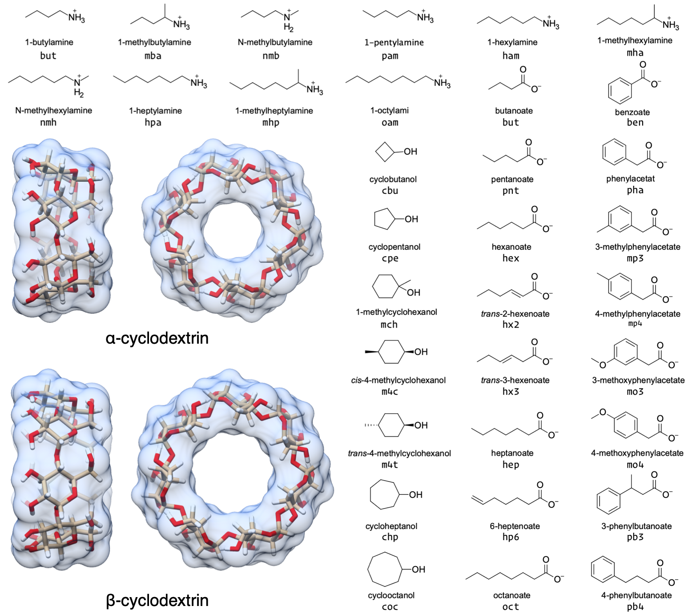

## Methods

### Choice of host-guest systems
In this study, we report the binding thermodynamics of 43 host-guest complexes (Figure @fig:host-guest-pairs and Table @tbl:host-guests) computed using three different force fields. 
The complexes consist of either α- or β-cyclodextrin as host molecules and a series of small molecule guests containing ammonium, carboxylate, or cyclic alcohol functional groups.
Cyclodextrins are cyclic polymers consisting of six (αCD) or seven (βCD) glucose monomers in the shape of a truncated cone.
The equilibrium constants and standard molar enthalpies of binding for these 43 complexes have been measured using isothermal titration calorimetry (ITC) and nuclear magnetic resonance spectroscopy (NMR) [@doi:10.1021/jp962715n] and computationally in [@doi:10.1021/acs.jctc.7b00359].
As in Henriksen, *et al.* [@doi:10.1021/acs.jctc.7b00359], only a single stereoisomer was considered for the 1-methylammonium guests because it was not clear whether a mixture or a pure solution was used in Rekharsky, et al. [@doi:10.1021/jp962715n], and the ΔG difference between each stereoisomer is expected to be < 0.1 kcal/mol [@doi:10.1021/ja9921118].

{#fig:host-guest-pairs}

|  Host-guest ID | Host | Guest | Charge |
| --- | --- | --- | --- |
|  a-bam | αCD | 1-butylamine | +1 |
|  a-nmb | αCD | n-methylbutylamine| +1 |
|  a-mba | αCD | 1-methylbutylamine^a^ | +1 |
|  a-pam | αCD | 1-pentylamine| +1 |
|  a-ham | αCD | 1-hexylamine| +1 |
|  a-nmh | αCD | n-methylhexylamine | +1 |
|  a-mha | αCD | 1-methylhexylamine^a^ | +1 |
|  a-hpa | αCD | 1-heptylamine | +1 |
|  a-mhp | αCD | 1-methylheptylamine^b^ | +1 |
|  a-oam | αCD | 1-octylamine | +1 |
|  b-ham | βCD | 1-hexylamine | +1 |
|  b-mha | βCD | 1-methylhexylamine^a^ | +1 |
|  b-oam | βCD | 1-octylamine | +1 |
|  a-cbu | αCD | cyclobutanol | 0 |
|  a-cpe | αCD | cyclopentanol | 0 |
|  a-chp | αCD | cycloheptanol | 0 |
|  a-coc | αCD | cyclooctanol | 0 |
|  b-cbu | βCD | cyclobutanol | 0 |
|  b-cpe | βCD | cyclopentanol | 0 |
|  b-mch | βCD | 1-methylcyclohexanol | 0 |
|  b-m4c | βCD | cis-4-methylcyclohexanol | 0 |
|  b-m4t | βCD | trans-4-methylcyclohexanol | 0 |
|  b-chp | βCD | cycloheptanol | 0 |
|  b-coc | βCD | cyclooctanol | 0 |
|  a-but | αCD | butanoate | -1 |
|  a-pnt | αCD | pentanoate | -1 |
|  a-hex | αCD | hexanoate | -1 |
|  a-hx2 | αCD | trans-2-hexenoate | -1 |
|  a-hx3 | αCD | trans-3-hexenoate | -1 |
|  a-hep | αCD | heptanoate | -1 |
|  a-hp6 | αCD | 6-heptenoate | -1 |
|  a-oct | αCD | octanoate | -1 |
|  b-pnt | βCD | pentanoate | -1 |
|  b-hex | βCD | hexanoate | -1 |
|  b-hep | βCD | heptanoate | -1 |
|  b-ben | βCD | benzoate | -1 |
|  b-pha | βCD | phenylacetate | -1 |
|  b-mp3 | βCD | 3-methylphenylacetate | -1 |
|  b-mp4 | βCD | 4-methylphenylacetate | -1 |
|  b-mo3 | βCD | 3-methoxyphenylacetate | -1 |
|  b-mo4 | βCD | 4-methoxyphenylacetate | -1 |
|  b-pb3 | βCD | 3-phenylbutanoate | -1 |
|  b-pb4 | βCD | 4-phenylbutanoate | -1 |

Table: The 43 unique host-guest combinations used in this study. The formal charge of each guest is listed in brackets. The guest names correspond to Tables 1 and 2 in Rekharsky et al. [@doi:10.1021/jp962715n]. ^a^ Only the *R* enantiomer was considered. ^b^ Only the *S* enantiomer was considered. {#tbl:host-guests}

### Application of force field parameters

We sought to compare force fields directly, and as such, attempted to minimize additional differences between the simulations with each force field.
In all simulations, we applied AM1-BCC [@doi:10.1002/jcc.10128; @doi:10/cvvpkv] partial atomic charges to both the host and guest molecules using the `antechamber` program.
The host charges were calculated using a single glucose molecule with methoxy caps on the O1 and O4 alcohols (Figure @fig:atom-names); each glucose monomer in the cyclodextrin polymer has identical charges.
We used TIP3P water [@doi:10.1063/1.445869] and Joung-Cheatham monovalent ion parameters [@doi:10.1021/jp8001614] in each simulation set.

{width="100%" #fig:atom-names}

GAFF v1.7 bond, angle, torsion, and Lennard-Jones parameters were applied using the `tleap` program distributed with AmberTools16.

GAFF v2.1 parameters were applied in an identical manner to the GAFF v1.7 parameters, using the `tleap` program distributed with AmberTools18 and substituting `leaprc.gaff` for `leaprc.gaff2` in the `tleap` input file.
In GAFF v2.1, the bond and angle parameters have been updated to reproduce small molecule geometries obtained from high-level quantum mechanical calculations.
The force constants for the bond and angle parameters were tuned to reproduce the vibrational spectra of over 600 molecules.
The torsion parameters were optimized to reproduce the rotational potential energy surface of 400 model compounds.
Finally, the Lennard-Jones coefficients were redeveloped to reproduce interaction energies and pure liquid properties.
**See [#7](https://github.com/slochower/smirnoff-host-guest-manuscript/issues/7).**

To apply SMIRNOFF99Frosst parameters, we followed a [multistep process](https://github.com/slochower/smirnoff-host-guest/blob/master/02-convert-APR-files.ipynb), beginning with the prepared GAFF v1.7 files.
The host and guest molecules were parameterized with the Open Force Field Toolkit version 0.0.3, SMIRNOFF version 1.0, and SMIRNOFF99Frosst version 1.0.5.
Once parameterized with SMIRNOFF99Frosst, the toplogy and coordinates for the host-guest complex was combined with the solvent and ions, which retained their TIP3P water parameters and Joung-Cheatham ion parameters, respectively.
This was accomplished by the `ParmEd` program [@doi:10.1007/s10822-016-9977-1], which enables saving the OpenMM system created by the Open Force Field Toolkit in AMBER-format `.prmtop` and `.inpcrd` files.
**See [#8](https://github.com/slochower/smirnoff-host-guest-manuscript/issues/8).**

### Thermodynamic calculation
We used the attach-pull-release (APR) method as implemented in the open source package pAPRika version 0.0.3, to calculate absolute binding free energies.
A complete description of the APR method has been provided in the literature [@doi:10.1021/acs.jctc.5b00405; @doi:10.1002/jcc.23398; @doi:10.1007/s10822-014-9735-1; @doi:10.1021/ct5004109].
The attachment and release phases consisted of 15 independent windows.
During the attachment phase, the force constants on the host and guest are scaled by a $\lambda$ parameter that goes from $\lambda = 0$, at which point all restraints are turned off, to $\lambda = 1$, at which point all restraints are at their maximum force constant. 
The $\lambda$ windows are more densely spaced where the force constant is smaller to improve sampling along highly curved regions of the potential of mean force.
Conformational restraints were applied between neighboring glucose units of the cyclodextrin to limit the incursion of monomers into the host cavity. 
These restraints were applied along the pseudodihedrals $\ce{{ "{{" }}O5}_n-{C1}_n-{O1}_n-{C4}_{n+1{{ "}}" }}$ and $\ce{{ "{{" }}C1}_n-{O1}_n-{C4}_{n+1}-{C5}_{n+1{{ "}}" }}$ to improve convergence and sampling of the bound state (Figure @fig:atom-names for atom names). 
To further improve sampling, we applied a hard wall restraint that confined the guest molecule to within a sphere of 12.3 and 13.5 Å of αCD and βCD, respectively, during the bound state.
The release phase is the conceptual reverse of the attach phase, in which the conformational restraints on the host are gradually turned off ($\lambda =1 \rightarrow 0$) in the absence of the guest.
This explicit release phase is performed once for αCD and once for βCD. 
Finally, an analytic correction is performed to compute the work of moving the guest from the restricted volume enforced by the APR restraints to standard state at 1 M concentration. 

The pulling phase consisted of 45 independent, equally spaced windows. 
During the pulling phase, the $\lambda$ parameter represents the target value of a distance restraint with constant force constant.
This target distance is increased uniformly in 45 increments of 0.4 Å, yielding windows that separate the host and guest by 18 Å over the course of the calculation.

Due to the asymmetry of the primary and secondary alcohols of cyclodextrin (Figure @fig:cavity), and the lack of symmetry of the small molecule guests, there are generally two distinct binding poses that do not interconvert during the simulation timescale.
To account for this effect, we separately compute the binding free energy and enthalpy for each orientation [@doi:10.1021/acs.jctc.5b00405] and combine the results to produce a single value for each host-guest combination using the following equation:

\begin{equation}
\Delta G = -RT \ln(\exp(-\beta \Delta G_\text{primary}) + \exp(-\beta \Delta G_\text{secondary})).
\end{equation}

In this manuscript, we refer to calculations whereby the guest is pulled out of the primary face of cyclodextrin with a `-p` suffix and calculations whereby the guest is pulled out of the secondary orientation with a `-s` suffix.

Thermodynamic integration was used to compute the binding free energy (ΔG). 
The binding enthalpy (ΔH) was computed as the difference in mean potential energy of the bound state (in the absence of any restraints) and the unbound state (where the guest is held far away from the host, but the conformational restraints on the host are disabled).
The binding entropy (ΔS) was computed by subtraction using ΔG and ΔH.

### Simulations
Simulations were performed with the `pmemd.cuda` module of AMBER 16 (calculations with the GAFF v1.7 force field) and AMBER 18 (calculations with the GAFF v2.1 and SMIRNOFF99Frosst force fields) molecular dynamics software [@url:www.ambermd.org]. 
Each window for each system was independently solvated and simulated.
The host-guest simulations using GAFF v1.7 were previously published in Henriksen, *et al.*  [@doi:10.1021/acs.jctc.7b00359] and are described in additional detail therein.
Solvation consisted of 2000 TIP3P waters for the αCD systems and 2210 waters for the βCD systems in an orthorhombic box. 
The host and guest were oriented via non-interacting dummy atoms along the simulation box $z$ axis, to create a rectangular periodic box, reducing the amount of solvent required for the calculation.
Each simulation contained enough Na^+^ or Cl^-^ ions to neutralize the host-guest complex and an additional 50 mM NaCl to match the experimental conditions in [@doi:10.1021/jp962715n]. 
In the GAFF simulations, hydrogen mass repartitioning [@doi:10.1021/ct5010406] was used to adjust the mass of hydrogen by a factor of 3, keeping the total molecular weight of each molecule constant, enabling a simulation timestep of 4 fs. 
Equilibration consisted of 50,000 steps of energy minimization, 100 ps of heating from 0 to 300 K, followed by 2000 ps of additional NPT simulations. 
A Langevin thermostat, the Monte Carlo barostat, a nonbonded cutoff of 9 Å and default PME parameters, were used for the NPT simulations.
An isotropic analytic correction to the Lennard-Jones interactions is applied beyond the cutoff distance [@doi:10.1063/1.2799191].
Production NPT simulations were run for a minimum of 2.5 ns and maximum of 50 ns per window, except for the windows used to calculate the enthalpy, which were simulated for 1 μs. 
In the GAFF v1.7 and GAFF v2.1 simulations, the exact length of each window's simulation was determined by the uncertainty in the work done in each λ window. 
For restraint energy $U$ in $\lambda$ window $i$, each window (except for the windows used to calculate ΔH) was simulated until the value $w(\lambda_i)$:

\begin{equation}
    w(\lambda_i) = 
    \begin{cases}
    \left\langle \frac{\partial U}{\partial \lambda_i} \right\rangle_\text{SEM} \cdot \frac{\lambda_{i+1}}{2} & i = 0 \\
    \left\langle \frac{\partial U}{\partial \lambda_i} \right\rangle_\text{SEM} \cdot \frac{\lambda_{i+1} - \lambda_{i-1}}{2} & i \in [1, N-1] \\
    \left\langle \frac{\partial U}{\partial \lambda_i} \right\rangle_\text{SEM} \cdot \frac{1 - \lambda_{i-1}}{2} & i = N \\
    \end{cases}
\end{equation}

fell below a threshold of 0.02 kcal/mol during the attach phase and 0.1 kcal/mol during the pull phase.

Excluding the first and last window, the average window length was 11.8 ns and 5.39 ns for GAFF v1.7 and GAFF v2.1 simulations, respectively.
In the interest of simplicity, SMIRNOFF99Frosst production NPT simulations were run for 10 ns per window, except for the first and last window which ran for 1 μs to calculate ΔH.

### Statistics
The uncertainty in the work done by each restraint in each simulation window, $\left\langle \frac{\partial U}{\partial \lambda_i} \right\rangle_\text{SEM}$, was estimated using blocking analysis [@doi:10.1063/1.457480].
Based on these values, resampling with replacement was used to create 100,000 hypothetical $\frac{\partial U}{\partial \lambda}$ curves.
The standard deviation in the integrated work, $\int \frac{\partial U}{\partial \lambda_i}\,\mathrm{d}\lambda_i$, of the 100,000 curves was used to determine the standard error of the mean of ΔG.
The standard error of the mean of ΔH was computed from the standard error of the mean of the total potential energy in each end point window, estimated using blocking analysis, added in quadrature.
The standard error of the mean −TΔS was calculated using the uncertainties in ΔG and ΔH added in quadrature.

For each force field, we computed the root mean squared error (RMSE), mean signed error (MSE), the coefficient of determination (R^2^), Kendall's rank correlation coefficient (τ), and the slope and intercept of the computed properties relative to the experimental values.
We also test how the force fields compare to each other using these statistics.
Comparisons with experiment have 43 data points, for the 43 unique host-guest complexes listed in Table @tbl:host-guests; comparisons between force fields have 86 data points, representing the two separate calculations performed for each host-guest pair.

The overall RMSE and R^2^ values for each comparison are reported as the mean with the 95% confidence interval in brackets.
These values are estimated by using the uncertainties assigned to each data point to create 100,000 hypothetical graphs through resampling with replacement.
The R^2^ values for each functional group subset is also reported in the bottom right corner in each graph.
