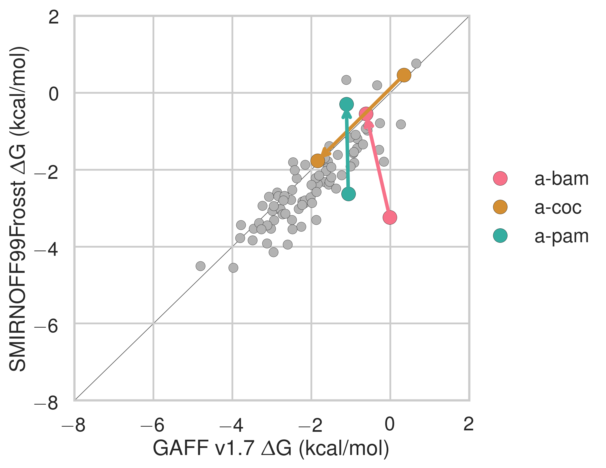
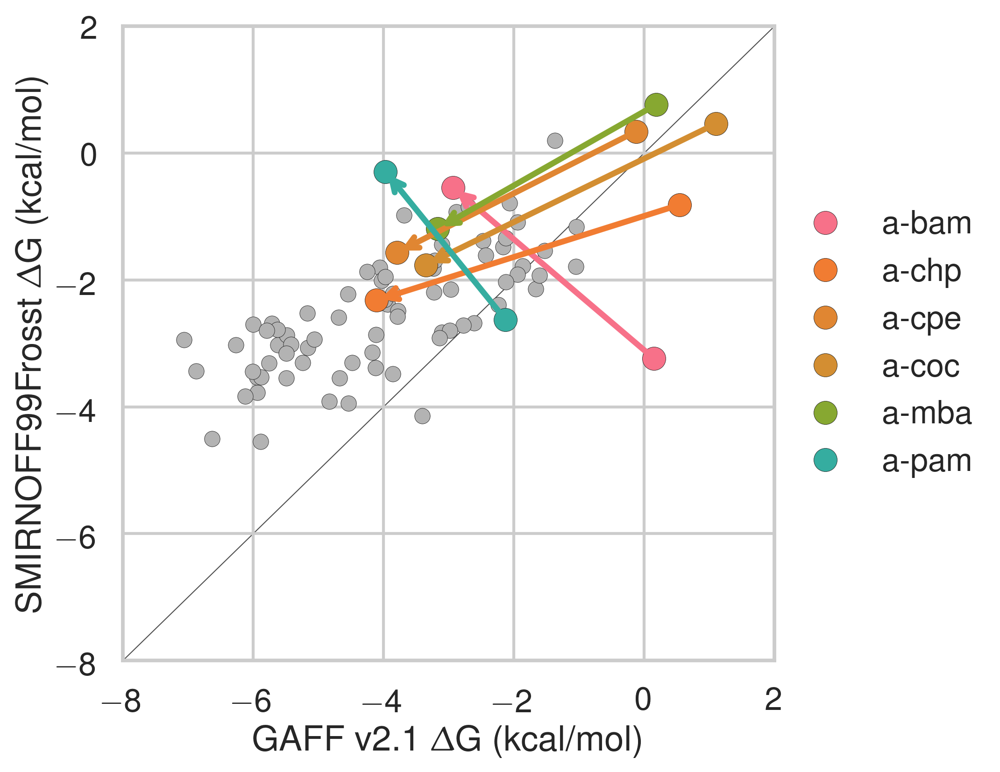

## Results and discussion

This results section is organized as follows. We first present a comparison of SMIRNOFF99Frosst and two iterations of the General AMBER Force Field (GAFF [@doi:10.1002/jcc.20035]) on predicting binding free energies (ΔG) and binding enthalpies (ΔH) of small molecule guests to α-cyclodextrin (αCD) and β-cyclodextrin (βCD). 
We then detail how the conformational preferences of guest molecules changes between force fields and finally we summarize the parameter differences between SMIRNOFF99Frosst and GAFF along with the effects of the parameter differences. 

### Binding free energies and enthalpies

SMIRNOFF99Frosst does about as well as, or even better than GAFF v1.7 on predicted ΔG and ΔH compared to the values measured with isothermal titration calorimetry, despite having far fewer numerical parameters.
SMIRNOFF99Frosst has an overall deviation from experiment of under 1 kcal/mol on binding free energies and under 2 kcal/mol on binding enthalpies across the 43 host-guest systems (@fig:dG-dH and Table @tbl:dG-overall).
Overall, the correlation between SMIRNOFF99Frosst and experiment is mediocre, ranging from an R$^2$ value of 0.34 to 0.54 for ΔG.
The results are more varied for ΔH with R$^2$ ranging from 0.09 to 0.54.
In particular, SMIRNOFF99Frosst underestimates the binding free energy and binding enthalpy of cyclic alcohols and mostly underestimates the binding entropy ([@fig:TdS]).
Guests containing ammonium or carboxylate functional groups appear to be equally over- and under-estimated for binding free energy.

Notably, SMIRNOFF99Frosst does better on αCD than βCD ([@fig:dG-dH-by-cyclodextrin]).

{ width=3.5in}
{width=3.5in}

{width=3.5in}
{width=3.5in}

{width=3.5in}
{width=3.5in}

Comparison of calculated absolute binding free energies (ΔG) and binding enthalpies (ΔH) with experiment with SMIRNOFF99Frosst parameters (top), GAFF v1.7 parameters (middle), or GAFF v2.1 parameters (bottom) applied to both host and guest. The orange, blue, and purple coloring distinguish the functional group of the guest as an ammonium, alcohol, or carboxylate, respectively.

|   |  | RMSE (kcal/mol) |  | MSE (kcal/mol) |  | R² |  | Slope |  | Intercept (kcal/mol) |  |
| --- | --- | --- | --- | --- | --- | --- | --- | --- | --- | --- | --- |
|   |  | Mean | SEM | Mean | SEM | Mean | SEM | Mean | SEM | Mean | SEM |
|  ΔG | SMIRNOFF99Frosst | 0.91 | 0.11 | **-0.01** | **0.14** | 0.34 | 0.11 | 0.49 | 0.12 | -1.55 | 0.38 |
|  ΔG | GAFF v1.7 | **0.88** | **0.09** | 0.46 | 0.12 | 0.54 | 0.10 | 0.69 | 0.11 | **-0.48** | **0.35** |
|  ΔG | GAFF v2.1 | 1.68 | 0.09 | -1.56 | 0.10 | **0.82** | **0.08** | **1.19** | **0.09** | -1.00 | 0.28 |
|   |  |  |  |  |  |  |  |  |  |  |  |
|  ΔH | SMIRNOFF99Frosst | **1.85** | **0.23** | **0.77** | **0.26** | 0.44 | 0.12 | **0.85** | **0.17** | **0.41** | **0.52** |
|  ΔH | GAFF v1.7 | 2.54 | 0.24 | 1.84 | 0.27 | 0.39 | 0.12 | 0.80 | 0.18 | 1.36 | 0.60 |
|  ΔH | GAFF v2.1 | 2.21 | 0.23 | -1.64 | 0.23 | **0.75** | **0.08** | 1.38 | 0.12 | -0.69 | 0.40 |
|   |  |  |  |  |  |  |  |  |  |  |  |
|  -TΔS | SMIRNOFF99Frosst | 1.90 | 0.21 | -0.78 | 0.27 | 0.40 | 0.13 | 0.90 | 0.20 | -0.83 | 0.25 |
|  -TΔS | GAFF v1.7 | 2.21 | 0.24 | -1.38 | 0.27 | 0.43 | 0.13 | **0.96** | **0.21** | -1.41 | 0.24 |
|  -TΔS | GAFF v2.1 | **1.47** | **0.24** | **0.08** | **0.23** | **0.60** | **0.14** | 1.14 | 0.18 | **0.15** | **0.21** |

Table: Predicted thermodynamic properties for each force field relative to experiment. {#tbl:statistics}

Likewise, GAFF v1.7 has very similar properties with an RMSE for ΔG of 0.88 kcal/mol and RMSE for ΔH of 2.54 kcal/mol.
Both SMIRNOFF99Frosst and GAFF v1.7 systematically underestimate the binding free energy for cyclic alcohols except for beta-cyclodextrin with cyclopentanol (b-cpe).

Overall, GAFF v2.1 has a larger RMSE than either SMIRNOFF99Frosst or GAFF v1.7 on binding free energies, but strikingly strong correlations with the experimental values across all three functional group classes.
Compared to SMIRNOFF99Frosst and GAFF v1.7, GAFF v2.1 uniformly overestimates both the binding free energy and binding enthalpy.

SMIRNOFF99Frosst does a great job predicting the binding free energy of αCD with alcohols, with four of the five points nearly falling on the line of identity.

[Show highlights here]{.banner .lightgrey}

Likewise, SMIRNOFF99Frosst does a great job with amines (?) with three of the four points falling nearly on the line of identity.

With βCD, on teh other hand, things are a little different: two of the three carboxylates are overestimated, ammoniums are great, but the alcohols are all over the place (two overestimated, two understimated.)

This difference is likely because... (?) of flexibility? (Is alpha more flexible than beta?)

### Guest preferences for primary and secondary binding

There are two orientations for binding: one where the primary functional group is interacting with the more narrow opening primary alcohols and one with the polar group oriented out of the wider, secondary opening.

The experimental data is a Boltzmann weighted ensemble of these two orientations.

{width=3.5in}
{width=3.5in}

Binding free energies (ΔG) with the primary orientation results colored in blue and secondary orientation results colored in green.

{width=3.5in}
{width=3.5in}

Binding free energies (ΔG) replotted from [@fig:by-orientation-comparison] with points whose difference in binding free energy along either axis is greater than 2 kcal/mol shown in color. Arrows point from primary to secondary. `This is backwards of the next plot.`

{width=3.5in}
{width=3.5in}
{width=3.5in}

The differences in binding free energy (ΔG) between guests leaving through either the primary or secondary face of αCD or βCD. Arrows point from the binding affinity for the secondary to the binding affinity for     the primary cavity. The systems with the largest ΔG difference are placed at the top.

### Guest preferences for αCD and βCD

{width=3.5in}
{width=3.5in}
{width=3.5in}

The differences in binding free energy (ΔG) between the same guest binding to either αCD or βCD. The binding affinity for αCD is circled in black.

### Functional group interactions

{width=3.5in}
{width=3.5in}

Binding free energy (ΔG) comparisons showing ammonium guests in color and highlighted. Darker colors indicate... 

{width=3.5in}
{width=3.5in}

Binding free energy (ΔG) comparisons showing alcohols guests in color and highlighted. Darker colors indicate... 

{width=3.5in}
{width=3.5in}

Binding free energy (ΔG) comparisons showing alcohols guests in color and highlighted. Darker colors indicate... 

### Differences in force field parameters between SMIRNOFF99Frosst and GAFF

Next, we summarize the parameter differences between SMIRNOFF99Frosst, a decendent of parm@Frosst and GAFF v1.7 (released circa March 2015 according to `gaff.dat` distributed with AMBER16) and GAFF v2.1 (under active development).

The σ and ε parameters are identical between SMIRNOFF99Frosst and GAFF v1.7
Compared to GAFF v2.1, SMIRNOFF99Frosst has deeper well depths for oxygens and decreased σ values for the hydroxyl hydrogens.

{width=3.5in}
{width=3.5in}

A comparison of Lennard-Jones nonbonded parameters for SMIRNOFF99Frosst and GAFF v2.1. Values that differ by more than 10% are labeled in red. Atom names refer to [@fig:atom-names]. 

Compared to GAFF v1.7, SMIRNOFF99Frosst tends to have slightly larger bond force constants, except for the $\ce{O-H}$ hydroxyl bond force constant, which is much stronger.
In GAFF v2.1, the $\ce{O-H}$ hydroxyl bond force constant is consistent with SMIRNOFF99Frosst, but the carbon-oxygen bond constants are weaker.
Equilibrium bond lengths are very similar ([@fig:bond-req]).

{width=3.5in}
{width=3.5in}

A comparison of bonded parameters for SMIRNOFF99Frosst, GAFF v1.7, and GAFF v2.1. Values that differ by more than 10% are labeled in red. Atom names refer to [@fig:atom-names]. 

Relative to GAFF v1.7 and GAFF v2.1, SMIRNOFF99Frosst has fewer unique angle parameters applied to αCD; several distinct parameters appear to be compressed into a single force constant, around 50 kcal/mol/rad^2^.
These parameters correspond to $\ce{C-C-C}$, $\ce{C-O-C}$, and $\ce{O-C-O}$ angles.
The $\ce{C-C-C}$ angles are primarily around the ring of the glucose monomer.
The $\ce{C-O-C}$ angles are both around the ring and between monomers (e.g., $\ce{C1-O1-C4}$ and $\ce{C1-O5-C5}$).
Weaker force constants for these parameters may  lead to increased flexibility.

{width=3.5in}
{width=3.5in}

{width=3.5in}
{width=3.5in}

A comparison of angle parameters for SMIRNOFF99Frosst, GAFF v1.7, and GAFF v2.1. Values that differ by more than 10% are labeled in red. Precise atom names have been omitted to compress multiple angles with the same parameter values into a single label.

#### Dihedrals

[Include the table of dihedral differences here.]{.banner .lightgrey}

The dihedral parameters between SMIRNOFF99Frosst and GAFF v1.7 are very similar, with hte expceiton of... (Table @tbl:S99-vs-GAFF-v1.7).

|   |  |  |  |  |  | SMIRNOFF99Frosst | GAFF v1.7 |
| --- | --- | --- | --- | --- | --- | --- | --- |
|  Atom 1 | Atom 2 | Atom 3 | Atom 4 | Per | Phase | Height (kcal/mol) | Height (kcal/mol) |
|  H1 | C1 | C2 | O2 | 1 | 0 | 0.25 | -- |
|  H1 | C1 | C2 | O2 | 3 | 0 | 0.00 | 0.16 |

Table: Dihedral parameter differences between SMIRNOFF99Frosst and GAFF v1.7. {#tbl:S99-vs-GAFF-v1.7}

![The dihedral energy term applied to H1-C1-C2-O2 in SMIRNOFF99Frosst and GAFF v1.7. Atom names refer to [@fig:atom-names].](images/SMIRNOFF99Frosst-vs-GAFF-v1.7-H1-C2-C2-O2.png){#fig:dihedral width=3.5in}

The dihedral parameters in GAFF v2.1 differ significantly from those in SMIRNOFF99Frosst.

|   |  |  |  |  |  | SMIRNOFF99Frosst | GAFF v2.1 |
| --- | --- | --- | --- | --- | --- | --- | --- |
|  Atom 1 | Atom 2 | Atom 3 | Atom 4 | Per | Phase | Height (kcal/mol) | Height (kcal/mol) |
|  C1 | C2 | O2 | HO2 | 1 | 0 | 0.25 | -- |
|  C1 | C2 | O2 | HO2 | 3 | 0 | 0.16 | 0.00 |
|  C1 | O5 | C5 | C4 | 1 | 0 | -- | 0.00 |
|  C1 | O5 | C5 | C4 | 2 | 0 | 0.10 | 0.16 |
|  C1 | O5 | C5 | C4 | 3 | 0 | 0.38 | 0.24 |
|  C1 | O5 | C5 | C6 | 1 | 0 | -- | 0.00 |
|  C1 | O5 | C5 | C6 | 2 | 0 | 0.10 | 0.16 |
|  C1 | O5 | C5 | C6 | 3 | 0 | 0.38 | 0.24 |
|  C2 | C1 | O5 | C5 | 1 | 0 | -- | 0.00 |
|  C2 | C1 | O5 | C5 | 2 | 0 | 0.10 | 0.16 |
|  C2 | C1 | O5 | C5 | 3 | 0 | 0.38 | 0.24 |
|  C2 | C3 | O3 | HO3 | 1 | 0 | 0.25 | -- |
|  C2 | C3 | O3 | HO3 | 3 | 0 | 0.16 | 0.00 |
|  C5 | C6 | O6 | HO6 | 1 | 0 | 0.25 | -- |
|  C5 | C6 | O6 | HO6 | 3 | 0 | 0.16 | 0.00 |
|  H1 | C1 | C2 | O2 | 1 | 0 | 0.25 | -- |
|  H1 | C1 | C2 | O2 | 3 | 0 | 0.00 | 0.16 |
|  O1 | C1 | C2 | O2 | 1 | 0 | -- | 0.02 |
|  O1 | C1 | C2 | O2 | 2 | 0 | 1.18 | 0.00 |
|  O1 | C1 | C2 | O2 | 3 | 0 | 0.14 | 1.01 |
|  O2 | C2 | C1 | O5 | 1 | 0 | -- | 0.02 |
|  O2 | C2 | C1 | O5 | 2 | 0 | 1.18 | 0.00 |
|  O2 | C2 | C1 | O5 | 3 | 0 | 0.14 | 1.01 |
|  O5 | C5 | C6 | O6 | 1 | 0 | -- | 0.02 |
|  O5 | C5 | C6 | O6 | 2 | 0 | 1.18 | 0.00 |
|  O5 | C5 | C6 | O6 | 3 | 0 | 0.14 | 1.01 |
|  HO2 | O2 | C2 | C3 | 1 | 0 | 0.25 | -- |
|  HO2 | O2 | C2 | C3 | 3 | 0 | 0.16 | 0.00 |
|  HO3 | O3 | C3 | C4 | 1 | 0 | 0.25 | -- |
|  HO3 | O3 | C3 | C4 | 3 | 0 | 0.16 | 0.00 |

Table: Dihedral parameter differences between SMIRNOFF99Frosst and GAFF v2.1, where one dihedral has fewer or more periodicity terms than the correspeonding term in the other force field. {#tbl:S99-vs-GAFF-v2.1-missing}

|   |  |  |  |  |  | SMIRNOFF99Frosst | GAFF v2.1 |
| --- | --- | --- | --- | --- | --- | --- | --- |
|  Atom 1 | Atom 2 | Atom 3 | Atom 4 | Per | Phase | Height (kcal/mol) | Height (kcal/mol) |
|  C1 | C2 | C3 | C4 | 1 | 0 | 0.20 | 0.11 |
|  C1 | C2 | C3 | C4 | 2 | 0 | 0.25 | 0.29 |
|  C1 | C2 | C3 | C4 | 3 | 0 | 0.18 | 0.13 |
|  C1 | C2 | C3 | O3 | 3 | 0 | 0.16 | 0.21 |
|  C1 | O5 | C5 | H5 | 3 | 0 | 0.38 | 0.34 |
|  C2 | C3 | C4 | C5 | 1 | 0 | 0.20 | 0.11 |
|  C2 | C3 | C4 | C5 | 2 | 0 | 0.25 | 0.29 |
|  C2 | C3 | C4 | C5 | 3 | 0 | 0.18 | 0.13 |
|  C3 | C4 | C5 | C6 | 1 | 0 | 0.20 | 0.11 |
|  C3 | C4 | C5 | C6 | 2 | 0 | 0.25 | 0.29 |
|  C3 | C4 | C5 | C6 | 3 | 0 | 0.18 | 0.13 |
|  C4 | C5 | C6 | O6 | 3 | 0 | 0.16 | 0.21 |
|  H1 | C1 | C2 | H2 | 3 | 0 | 0.15 | 0.16 |
|  H2 | C2 | C3 | H3 | 3 | 0 | 0.15 | 0.16 |
|  H2 | C2 | O2 | HO2 | 3 | 0 | 0.17 | 0.11 |
|  H3 | C3 | C4 | H4 | 3 | 0 | 0.15 | 0.16 |
|  H3 | C3 | O3 | HO3 | 3 | 0 | 0.17 | 0.11 |
|  H4 | C4 | C5 | H5 | 3 | 0 | 0.15 | 0.16 |
|  H5 | C5 | C6 | H61 | 3 | 0 | 0.15 | 0.16 |
|  H5 | C5 | C6 | H62 | 3 | 0 | 0.15 | 0.16 |
|  O1 | C1 | O5 | C5 | 1 | 0 | 1.35 | 0.97 |
|  O1 | C1 | O5 | C5 | 2 | 0 | 0.85 | 1.24 |
|  O1 | C1 | O5 | C5 | 3 | 0 | 0.10 | 0.00 |
|  O2 | C2 | C3 | C4 | 3 | 0 | 0.16 | 0.21 |
|  O2 | C2 | C3 | O3 | 2 | 0 | 1.18 | 1.13 |
|  O2 | C2 | C3 | O3 | 3 | 0 | 0.14 | 0.90 |
|  O3 | C3 | C4 | C5 | 3 | 0 | 0.16 | 0.21 |
|  H61 | C6 | O6 | HO6 | 3 | 0 | 0.17 | 0.11 |
|  H62 | C6 | O6 | HO6 | 3 | 0 | 0.17 | 0.11 |

Table: Dihedral parameter differences between SMIRNOFF99Frosst and GAFF v2.1, only height differences. {#tbl:S99-vs-GAFF-v2.1}

...Inter-residue dihedrals...

|   |  |  |  |  |  |  |  |  |  |  | SMIRNOFF99Frosst | GAFF v2.1 |
| --- | --- | --- | --- | --- | --- | --- | --- | --- | --- | --- | --- | --- |
|  ID | Atom 1 | Res 1 | Atom 2 | Res 2 | Atom 3 | Res 3 | Atom 4 | Res 4 | Per | Phase | Height (kcal/mol) | Height (kcal/mol) |
|  1 | C1 | *n* | O1 | *n* | C4 | *n+1* | C3 | *n+1* | 1 | 0 | -- | 0.00 |
|   | C1 | *n* | O1 | *n* | C4 | *n+1* | C3 | *n+1* | 2 | 0 | 0.10 | 0.16 |
|   | C1 | *n* | O1 | *n* | C4 | *n+1* | C3 | *n+1* | 3 | 0 | 0.38 | 0.24 |
|  2 | C1 | *n* | O1 | *n* | C4 | *n+1* | C5 | *n+1* | 1 | 0 | -- | 0.00 |
|   | C1 | *n* | O1 | *n* | C4 | *n+1* | C5 | *n+1* | 2 | 0 | 0.10 | 0.16 |
|   | C1 | *n* | O1 | *n* | C4 | *n+1* | C5 | *n+1* | 3 | 0 | 0.38 | 0.24 |
|  3 | C2 | *n* | C1 | *n+1* | O1 | *n+1* | C4 | *n+1* | 1 | 0 | -- | 0.00 |
|   | C2 | *n* | C1 | *n+1* | O1 | *n+1* | C4 | *n+1* | 2 | 0 | 0.10 | 0.16 |
|   | C2 | *n* | C1 | *n+1* | O1 | *n+1* | C4 | *n+1* | 3 | 0 | 0.38 | 0.24 |
|  4 | O1 | *n* | C4 | *n+1* | C3 | *n+1* | O3 | *n+1* | 1 | 0 | -- | 0.02 |
|   | O1 | *n* | C4 | *n+1* | C3 | *n+1* | O3 | *n+1* | 2 | 0 | 1.18 | 0.00 |
|   | O1 | *n* | C4 | *n+1* | C3 | *n+1* | O3 | *n+1* | 3 | 0 | 0.14 | 1.01 |
|  5 | O1 | *n* | C4 | *n+1* | C5 | *n+1* | O5 | *n+1* | 1 | 0 | -- | 0.17 |
|   | O1 | *n* | C4 | *n+1* | C5 | *n+1* | O5 | *n+1* | 2 | 0 | 1.18 | 0.00 |
|   | O1 | *n* | C4 | *n+1* | C5 | *n+1* | O5 | *n+1* | 3 | 0 | 0.14 | 0.00 |

Table: Inter-residue dihedral parameter differences between SMIRNOFF99Frosst and GAFF v2.1. {#tbl:S99-vs-GAFF-v2.1-inter}

{width=3.5in}
{width=3.5in}
{width=3.5in}

The dihedral energy term applied to three inter-residue dihedrals in SMIRNOFF99Frosst and GAFF v2.1. The third dihedral, affecting atoms O1n--C4n+1--C5n+1--O5n+1 is quite significantly different, with multiple minima and and barrier heights. This dihedral partially controls the rotation of glucose monomers towards or away from the interior of the cyclodextrin cavity. Surprisingly, glucose monomers in GAFF v2.1 penetrate the open cavity much less frequently than in SMIRNOFF99Frosst, despite the lower and broader dihedral energy in GAFF v2.1. Atom names refer to [@fig:atom-names]. 

### Structural consequences of the force field parameter differences

In both SMIRNOFF99Frosst and GAFF v1.7, the average RMSD of βCD is between 2 and 2.5 Å over 43 μs of simulation. GAFF v2.1 is significanly more rigid, with an average RMSD less than 1.0 Å from the initial structure ([@fig:flexibility]).

{#fig:flexibility width=100%}

<link rel="stylesheet" href="https://use.fontawesome.com/releases/v5.7.2/css/all.css">
 [<i class="fas fa-star"></i> Update font size in RMSD plots.]{.banner .lightgrey}