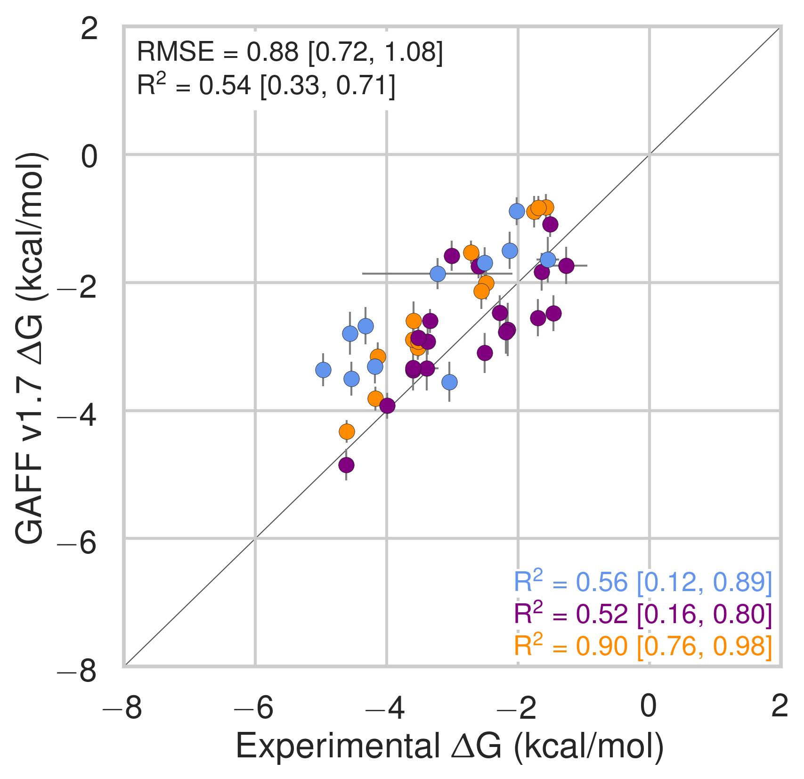

# Results and discussion

## Binding free energies and enthalpies

{#fig:somethingA width=3.5in}
{#fig:somethingB width=3.5in}

Comparison of calculated absolute binding free energies ($\Delta$G) and binding enthalpies ($\Delta$H) with experiment with SMIRNOFF99Frosst parameters applied to both host and guest. The orange, blue, and purple coloring distinguish the functional group of the guest as an ammonium, alcohol, or carboxylate, respectively.

SMIRNOFF99Frosst does about as well as, or even better than GAFF v1.7, despite having far fewer numerical parameters. GAFF v2.1 has a large RMSE, but surprisingly strong correlation with the experimental data.

{#fig:somethingA width=3.5in}
{#fig:somethingB width=3.5in}

Comparison of calculated absolute binding free energies ($\Delta$G) and binding enthalpies ($\Delta$H) with experiment with GAFF v1.7 parameters applied to both host and guest. The orange, blue, and purple coloring distinguish the functional group of the guest as an ammonium, alcohol, or carboxylate, respectively.

Both SMIRNOFF99Frosst and GAFF v1.7 systematically underestimate the binding free energy for cyclic alcohols except for beta-cyclodextrin with cyclopentanol (b-cpe).

[@fig:GAFF-v1.7-vs-experiment]

Notably, SMIRNOFF99Frosst does better on $\alpha$CD than $\beta$CD ([@fig:alpha-vs-beta]).

SMIRNOFF99Frosst does a great job predicting the binding free energy of $\alpha$CD with alcohols, with four of the five points nearly falling on the line of identity.

Likewise, SMIRNOFF99Frosst does a great job with amines (?) with three of the four points falling nearly on the line of identity.

With $\beta$CD, on teh other hand, things are a little different: two of the three carboxylates are overestimated, ammoniums are great, but the alcohols are all over the place (two overestimated, two understimated.)

This difference is likely because... (?) of flexibility? (Is alpha more flexible than beta?)

{#fig:flexibility width=100%}