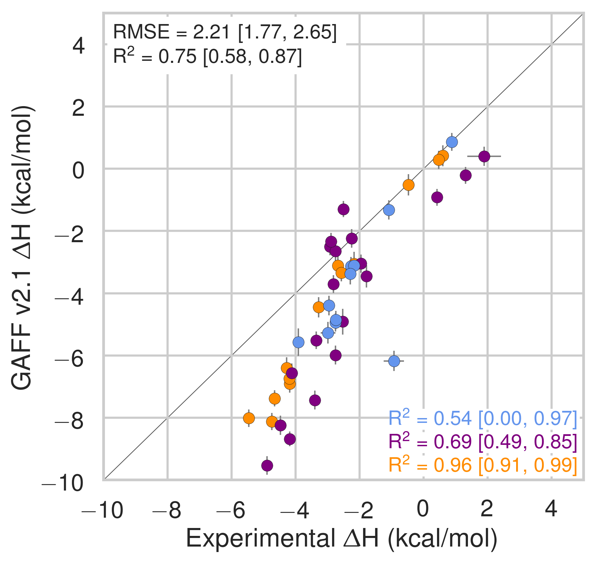

## Results and discussion

This results section is organized as follows. We first present a comparison of SMIRNOFF99Frosst and two iterations of the General AMBER Force Field (GAFF [@doi:10.1002/jcc.20035]) on predicting binding free energies ($\Delta$G) and binding enthalpies ($\Delta$H) of small molecule guests to $\alpha$-cyclodextrin ($\alpha$CD) and $\beta$-cyclodextrin ($\beta$CD). 
We then detail how the behaviors of guest molecules changes between force fields and finally we summarize the parameter differences between SMIRNOFF99Frosst and GAFF along with the effects of the parameter differences. 

### Binding free energies and enthalpies

SMIRNOFF99Frosst does about as well as, or even better than GAFF v1.7, depsite have far fewer numerical parameters on predicted $\Delta$G and $\Delta$H compared to the values measured with isothermal titration calorimetry. 
SMIRNOFF99Frosst has an overall agreement of under 1 kcal/mol on binding free energies and under 2 kcal/mol on binding enthalpies across the 43 host-guest systems ([@fig:dG-dH]).
Overall, the correlation between SMIRNOFF99Frosst and experiment is mediocre, ranging from an R$^2$ value of 0.34 to 0.54 for $\Delta$G.
The results are more varied for $\Delta$H with R$^2$ ranging from 0.09 to 0.54.
In particular, SMIRNOFF99Frosst underestimates the binding free energy and binding enthalpy of cyclic alcohols and mostly underestimates the binding entropy ([@fig:S99-vs-experiment-entropy]).
Guests containing ammonium or carboxylate functional groups appear to be equally over- and under-estimated for binding free energy.

Notably, SMIRNOFF99Frosst does better on $\alpha$CD than $\beta$CD ([@fig:S99-vs-experiment-by-cyclodextrin]).

{#fig:somethingA width=3.5in}
{#fig:somethingB width=3.5in}

{width=3.5in}
{width=3.5in}

{width=3.5in}
{width=3.5in}

Comparison of calculated absolute binding free energies ($\Delta$G) and binding enthalpies ($\Delta$H) with experiment with SMIRNOFF99Frosst parameters (top), GAFF v1.7 parameters (middle), or GAFF v2.1 parameters (bottom) applied to both host and guest. The orange, blue, and purple coloring distinguish the functional group of the guest as an ammonium, alcohol, or carboxylate, respectively.

Likewise, GAFF v1.7 has very similar properties with an RMSE for $\Delta$G of 0.88 kcal/mol and RMSE for $\Delta$H of 2.54 kcal/mol.
Both SMIRNOFF99Frosst and GAFF v1.7 systematically underestimate the binding free energy for cyclic alcohols except for beta-cyclodextrin with cyclopentanol (b-cpe).

Overall, GAFF v2.1 has a larger RMSE than either SMIRNOFF99Frosst or GAFF v1.7 on binding free energies, but strikingly strong correlations with the experimental values across all three functional group classes.
Compared to SMIRNOFF99Frosst and GAFF v1.7, GAFF v2.1 uniformly overestimates both the binding free energy and binding enthalpy.

SMIRNOFF99Frosst does a great job predicting the binding free energy of $\alpha$CD with alcohols, with four of the five points nearly falling on the line of identity.

[Show highlights here]{.banner .lightgrey}

Likewise, SMIRNOFF99Frosst does a great job with amines (?) with three of the four points falling nearly on the line of identity.

With $\beta$CD, on teh other hand, things are a little different: two of the three carboxylates are overestimated, ammoniums are great, but the alcohols are all over the place (two overestimated, two understimated.)

This difference is likely because... (?) of flexibility? (Is alpha more flexible than beta?)

### Guest preferences for primary and secondary binding

There are two orientations for binding: one where the primary functional group is interacting with the more narrow opening primary alcohols and one with the polar group oriented out of the wider, secondary opening.

The experimental data is a Boltzmann weighted ensemble of these two orientations.

### Guest preferences for $\alpha$CD and $\beta$CD

### Functional group interactions

### Differences in force field parameters between SMIRNOFF99Frosst and GAFF

Next, we summarize the parameter differences between SMIRNOFF99Frosst, a decendent of parm@Frosst and GAFF v1.7 (released circa March 2015 according to `gaff.dat` distributed with AMBER16) and GAFF v2.1 (under active development).

### Structural consequences of the force field parameter differences

In both SMIRNOFF99Frosst and GAFF v1.7, the average RMSD of $\beta$CD is between 2 and 2.5 Å over 43 $\mu$s of simulation. GAFF v2.1 is significanly more rigid, with an average RMSD less than 1.0 Å from the initial structure ([@fig:flexibility]).

{#fig:flexibility width=100%}

<link rel="stylesheet" href="https://use.fontawesome.com/releases/v5.7.2/css/all.css">
 [<i class="fas fa-star"></i> Update font size in RMSD plots.]{.banner .lightgrey}