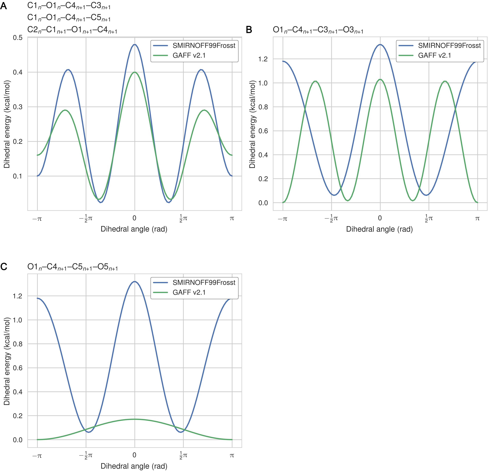

## Results

This results section is organized as follows. We first present a comparison of binding free energies (ΔG°) and binding enthalpies (ΔH) of small molecule guests to α-cyclodextrin (αCD) and β-cyclodextrin (βCD), computed with SMIRNOFF99Frosst and two versions of the General AMBER Force Field (GAFF [@doi:10.1002/jcc.20035]). 
We then detail how the conformational preferences of the host molecules changes between force fields and seek insight into key parameter differences between SMIRNOFF99Frosst and GAFF and their effects. 

### Comparison with experimental binding free energies, enthalpies, and entropies

#### Binding free energies

Despite having far fewer numerical parameters, SMIRNOFF99Frosst does about as well as GAFF v1.7 and arguably better than GAFF v2.1 at replicating binding free energies measured by ITC or NMR.
Thus, SMIRNOFF99Frosst yields an overall ΔG° RMSE from experiment of 0.9 [0.7, 1.1] kcal/mol across the 43 host-guest systems, compared to the statistically indistinguishable 0.9 [0.7, 1.1] kcal/mol for GAFF v1.7, and distinct from 1.7 [1.5, 1.9] kcal/mol for GAFF v2.1 (where the 95% confidence interval is written in brackets) as detailed in Figure @fig:dG-dH; Tables @tbl:statistics, @tbl:dG-combined. 

On the whole, GAFF v1.7 agrees well with SMIRNOFF99Frosst (Figure @fig:dG-by-orientation), as the RMSE and MSE between their results are 0.8 [0.6, 1.0] kcal/mol and -0.5 [-0.3, -0.7] kcal/mol.
This result is not surprising as GAFF v1.7 and SMIRNOFF99Frosst may be considered sibling force fields with a common ancestor in AMBER's parm99.
Both SMIRNOFF99Frosst and GAFF v1.7 systematically underestimate the binding affinity for cyclic alcohols, with MSEs of 0.7 [0.2, 1.2] kcal/mol and 0.9 [0.4, 1.4] kcal/mol, respectively. 
In contrast, GAFF v2.1 significantly overestimates the binding of all compounds, leading to MSE and RMSE values of -1.6 [-1.7, -1.4] kcal/mol and 1.6 [1.4, 1.8] kcal/mol, respectively.
However, GAFF v2.1 has a particularly good correlation with experiment across all functional group classes, with R² of 0.8 [0.6, 0.9], compared with 0.3 [0.1, 0.6] and 0.5 [0.3, 0.7] for SMIRNOFF99Frosst and GAFF 1.7, respectively.
This may trace to differences in the host conformations sampled by GAFF v2.1, which indicate a more consistently open cyclodextrin "pocket" for guests to bind (Figure @fig:flexibility), as detailed below.

#### Binding enthalpies and entropies

In the case of binding enthalpies (Figure @fig:dG-dH), SMIRNOFF99Frosst agrees the best with experiment (RMSE 1.8 [1.4, 2.3] kcal/mol), followed by GAFF v2.1 (RMSE = 2.2 [1.8, 2.7] kcal/mol), and then GAFF v1.7 (RMSE = 2.5 [2.0, 3.0] kcal/mol). 
In some cases, GAFF v1.7 underestimates ΔH by over 3 kcal/mol and up to 5 kcal/mol (`b-chp`).
For binding entropies, GAFF v2.1 has the lowest RMSE relative to experiment (RMSE = 1.47 [1.1, 2.0] kcal/mol), followed by SMIRNOFF99Frosst (RMSE = 1.9 kcal/mol [1.5, 2.3]), and GAFF v1.7 (RMSE = 2.2 [1.7, 2.7] kcal/mol) (Figure @fig:TdS).  
All force fields perform poorly at replicating −TΔS° for carboxylate guests, with RMSEs ranging from 1.8 [0.7, 3.2] kcal/mol (GAFF v2.1) to 3.0 [2.1, 3.9] kcal/mol (GAFF v1.7).
All force fields also underestimate the entropic component of binding of `a-coc` (αCD:cyclooctanol) relative to experiment, by 3-5 kcal/mol.
This is likely due to the poor fit of cycloctanol inside the cavity of αCD, particularly in the primary orientation (Figure @fig:by-orientation).
Overall, SMIRNOFF99Frosst and GAFF v1.7 yield rather different binding enthalpies (RMSE = 1.6 [1.3, 2.0] kcal/mol) and entropies (RMSE = 1.6 [1.2, 2.0] kcal/mol).
The deviations between SMIRNOFF99Frosst and GAFF v2.1 are higher for ΔH (RMSE = 3.0 [2.5, 3.4] kcal/mol) and lower for −TΔS° (RMSE = 1.9 [1.6, 2.2] kcal/mol).

{#fig:dG-dH}

|      |      | RMSE |      |  MSE |      |   R² |      | Slope |      | Intercept |      | 
|  ---  |  ---  |  ---  |  ---  |  ---  |  ---  |  ---  |  ---  |  ---  |  ---  |  ---  |  ---  | 
| ΔG | SMIRNOFF99Frosst | 0.91 | [0.71, 1.13] | -0.01 | [-0.29, 0.26] | 0.34 | [0.12, 0.56] | 0.49 | [0.26, 0.72] | -1.55 | [-0.80, -2.29] | 
| ΔG | GAFF v1.7 | 0.88 | [0.71, 1.08] | 0.46 | [0.23, 0.69] | 0.54 | [0.33, 0.71] | 0.69 | [0.47, 0.91] | -0.47 | [0.22, -1.16] | 
| ΔG | GAFF v2.1 | 1.68 | [1.51, 1.85] | -1.56 | [-1.74, -1.37] | 0.82 | [0.61, 0.92] | 1.19 | [0.96, 1.34] | -1.00 | [-0.52, -1.62] | 
| ΔH | SMIRNOFF99Frosst | 1.85 | [1.40, 2.30] | 0.77 | [0.26, 1.28] | 0.44 | [0.21, 0.66] | 0.85 | [0.54, 1.19] | 0.41 | [1.55, -0.50] | 
| ΔH | GAFF v1.7 | 2.54 | [2.08, 2.99] | 1.84 | [1.31, 2.37] | 0.39 | [0.17, 0.62] | 0.80 | [0.47, 1.18] | 1.36 | [2.66, 0.31] | 
| ΔH | GAFF v2.1 | 2.21 | [1.77, 2.66] | -1.64 | [-2.10, -1.20] | 0.75 | [0.57, 0.87] | 1.38 | [1.15, 1.63] | -0.69 | [0.15, -1.43] | 
| -TΔS | SMIRNOFF99Frosst | 1.90 | [1.49, 2.32] | -0.78 | [-1.29, -0.25] | 0.40 | [0.14, 0.63] | 0.90 | [0.51, 1.29] | -0.83 | [-0.34, -1.34] | 
| -TΔS | GAFF v1.7 | 2.21 | [1.74, 2.68] | -1.38 | [-1.90, -0.85] | 0.43 | [0.16, 0.68] | 0.95 | [0.54, 1.38] | -1.41 | [-0.95, -1.89] | 
| -TΔS | GAFF v2.1 | 1.47 | [1.09, 2.00] | 0.08 | [-0.35, 0.54] | 0.60 | [0.29, 0.80] | 1.14 | [0.75, 1.47] | 0.15 | [0.57, -0.27] | 

Table: Predicted thermodynamic properties for each force field relative to experiment. {#tbl:statistics} 

### Guest preferences for binding in the primary or secondary orientation
The asymmetry of the hosts and the guests leads to two distinct bound states for each host-guest pair: one where the functional group of the guest sits at the primary face of the host and another where the functional group of the guest sits at the secondary face (@fig:cavity).
The difference in binding free energy between these two orientations (ΔΔGorientation) can be large, at around 2 kcal/mol for SMIRNOFF99Frosst and GAFF v1.7 and 5 kcal/mol for GAFF v2.1.
SMIRNOFF99Frosst predicts the largest ΔΔGorientation for the ammonium-containing butylamine and pentylamine guests with αCD (@fig:by-orientation), with the primary orientation being more favorable. 
Thus, the cationic ammonium groups are predicted to prefer the narrower primary portal of the host.
GAFF v1.7 predicts a large ΔΔGorientation for the cyclic alcohols cyclooctanol and  cycloheptanol, with the secondary orientation having a more favorable ΔG.
When GAFF v2.1 is used, the differences between primary and secondary binding range even higher, greater than 4 kcal/mol, for αCD with these two guests.
This effect is due, at least in part, to steric clashes in the bound state for very large guests (Figure @fig:by-orientation, D), especially in the narrow primary cavity of the smaller αCD.
It is worth noting that the experimental measurement for the the `a-coc` (αCD:cyclooctanol) complex has very large uncertainties associated with both ΔG° and ΔH.

{#fig:by-orientation}

### Comparison of results for αCD versus βCD

It is of interest to compare the results between αCD and βCD by focusing on the ten guests for which experimental data are available with both hosts.
The SMIRNOFF99Frosst and GAFF 1.7 force fields both yield somewhat more accurate binding affinities for αCD (RMSE = 0.8 [0.5, 1.1] kcal/mol) than for βCD (RMSE = 1.0 [0.8, 1.3] kcal/mol), whereas no clear patterns is observed for GAFF v2.1 (Figure @fig:dG-dH-by-cyclodextrin). 
Much as seen for the two orientations of the guest molecules within each host, GAFF v2.1 yields relatively large differences in predicted free energies for each guest between the two hosts, but it does not seem to be more accurate for either host relative to the other.

{#fig:by-cyclodextrin}

### Trends by guest functional group

The SMIRNOFF99Frosst force field yields rather accurate binding free energies for binding of the ammonium guests (MSE = -0.1 [-0.5, 0.3] kcal/mol and RMSE = 0.7 [0.4, 1.1] kcal/mol) to both αCD and βCD (Figure @fig:ammonium and Table @tbl:overall-ammonium). It also replicates the experimental trends that shorter-chain molecules bind less strongly, and that each guest binds more strongly to αCD than βCD.
The results are also reasonably good for the cyclic alcohols (MSE = 0.7 [0.2, 1.2] kcal/mol and RMSE = 1.1 [0.7, 1.6] kcal/mol) (Figure @fig:alcohols and Table @tbl:overall-alcohols), though the predicted affinities for αCD are uniformly too weak, while those for βCD are mostly too strong.
Finally, SMIRNOFF99Frosst yields rather accurate binding affinities for the carboxylate guests with both αCD and βCD (MSE = -0.4 [-0.7, 0] kcal/mol  and RMSE = 0.9 [0.6, 1.2] kcal/mmol) (Figure @fig:carboxylates and Table @tbl:overall-carboxylates).

GAFF v1.7 tends to predict slightly weaker binding than SMIRNOFF99Frosst, whereas GAFF v2.1 predicts much stronger binding for all classses of guest compounds (Figures @fig:additional-highlights-ammonium, @fig:additional-highlights-alcohols, and @fig:additional-highlights-carboxylates).

{#fig:ammonium}

{#fig:alcohols}

{#fig:carboxylates}

### Differences in cyclodextrin force field parameters between SMIRNOFF99Frosst and GAFF

We now summarize differences among the parameters assigned to the host αCD by SMIRNOFF99Frosst, a descendant of parm99 and parm@Frosst; GAFF v1.7 (released circa March 2015 according to `gaff.dat` distributed with AMBER16); and GAFF v2.1 (which has not yet been published).
On going from GAFF v1.7 to GAFF v2.1, the bond and angle parameters were updated to reproduce small molecule geometries obtained from high-level quantum mechanical calculations and vibrational spectra of over 600 molecules; the torsion parameters were optimized to reproduce the potential energy surfaces of torsion angles in 400 model compounds; and the Lennard-Jones coefficients were redeveloped to reproduce interaction energies and pure liquid properties, as specified in the footer of `gaff2.dat` provided with AmberTools18.
Note that chemically analogous atoms, bonds, angles and torsions in αCD and βCD are assigned identical parameters.

#### Lennard-Jones

The SMIRNOFF99Frosst and GAFF v1.7 force fields assign identical σ and ε parameters to the atoms of αCD.
Note, that hydroxyl hydrogens are assigned σ = 0 Å and ε = 0 kcal/mol in both GAFF v1.7 and SMIRNOFF99Frosst v1.0.5, but later versions of SMIRNOFF99Frosst, produced after the calculations in the current manuscript, adopt [small σ and ε](https://github.com/openforcefield/smirnoff99Frosst/blob/4ca43af6241a97edb356586f3f83ac21afcdff65/smirnoff99Frosst/smirnoff99Frosst.offxml#L315) values based on a similiar atom type in parm@Frosst [@url:https://github.com/openforcefield/smirnoff99Frosst/pull/74; @url:https://github.com/openforcefield/openforcefield/pull/101; @url:https://github.com/openforcefield/smirnoff99Frosst/issues/61].
The GAFF v2.1 parameters differ in assigning shallower wells for oxygens and larger σ values for the hydroxyl hydrogens (Figure @fig:LJ).

{width="100%" #fig:LJ}

#### Bond stretches

Equilibrium bond lengths are very similar among the three force fields (Figure @fig:bond-req), but there are noticeable differences among the force constants (Figure @fig:bonds) 
Thus, compared to GAFF v1.7, SMIRNOFF99Frosst tends to have slightly larger bond force constants, except for the O--H hydroxyl bond force constant, which is much stronger.
In GAFF v2.1, the O--H hydroxyl bond force constant is very close to that of SMIRNOFF99Frosst, but the carbon-oxygen bond constants are distinctly weaker.

{width="100%" #fig:bonds}

#### Bond angles

Relative to GAFF v1.7 and GAFF v2.1, SMIRNOFF99Frosst has fewer unique angle parameters applied to αCD; several distinct parameters appear to be compressed into a single force constant, around 50 kcal/mol/rad^2^ (Figure @fig:angles).
These parameters correspond to C--C--C, C--O--C, O--C--O angles.
The C--C--C angles are primarily around the ring of the glucose monomer.
The C--O--C angles are both around the ring and between monomers (e.g., C1--O1--C4 and C1--O5--C5).
Weaker force constants for these parameters in GAFF v1.7 compared to GAFF v2.1 may lead to increased flexibility. 

{width="100%" #fig:angles}

#### Dihedral parameters

The dihedral parameters in SMIRNOFF99Frosst and GAFF v1.7 are extremely similar---where differences in barrier heights occur, they are in the hundredths or thousandths of 1 kcal/mol---with the exception of the H1--C1--C2--O2 parameter (Figure @fig:atom-names).
For this dihedral, which corresponds to GAFF atom types `h2-c3-c3-oh` and SMIRKS pattern `[#1:1]-[#6X4:2]-[#6X4:3]-[#8X2:4]`), SMIRNOFF99Frosst applies a single term with periodicity = 1 and GAFF v1.7 applies a single term with periodicity = 3 (Table @tbl:S99-vs-GAFF-v1.7, Figures @fig:dihedral).

{#fig:dihedral width=100%}

The dihedral parameters in GAFF v2.1 differ from those in SMIRNOFF99Frosst in a number of ways.
There are several dihedrals that have a different number of terms (Table @tbl:S99-vs-GAFF-v2.1-missing).
This is partly due to the addition of dihedral terms with a barrier height of exactly 0.00 kcal/mol in GAFF, which are used to override wildcard parameters that might match the same atom types. 
For example, GAFF v2.1 applies a three term energy function to the atom types `c3-os-c3-c3`, whereas SMIRNOFF99Frosst employs a two term energy function for the hydroxyl rotation SMIRKS pattern `[#6X4:1]-[#6X4:2]-[#8X2H0:3]-[#6X4:4]`, but only the terms with periodicity 2 and 3 have nonzero barrier heights in GAFF v2.1.
Similarly, SMIRNOFF99Frosst uses two nonzero terms to model the potential barrier for the SMIRKS pattern `[#6X4:1]-[#6X4:2]-[#8X2H1:3]-[#1:4]` yet GAFF v2.1 applies a single term with a barrier height of exactly 0.00 kcal/mol for the corresponding atom types `c3-c3-oh-ho`.
The fact that GAFF employs dihedral terms with zero amplitude terms highlights the complexity that would be required to optimize existing force fields that have accumulated legacy parameters needed to maintain backwards compatibility with older force fields and simulation codes.

In other cases, SMIRNOFF99Frosst and GAFF v2.1 have disagreements on the barrier height after matching the periodicity and phase for a given dihedral.
For example, the amplitudes for the O1--C1--O5--C5 dihedral are 1.35 kcal/mol and 0.97 kcal/mol for SMIRNOFF99Frosst and GAFF v2.1, respectively, for the term with periodicity = 1, whereas the amplitudes are 0.85 kcal/mol and 1.24 kcal/mol for SMIRNOFF99Frosst and GAFF v2.1, respectively, for the term with periodicity = 2.
It is notable that the barrier heights in GAFF v2.1 are similiar in magnitude to those in SMIRNOFF99Frosst, yet GAFF v2.1 produces much more rigid structures (Table @tbl:S99-vs-GAFF-v2.1, Figure @fig:flexibility), as detailed in the following section.
Moreoever, many of the dihedrals that act between a pair of neighboring glucose monomers (i.e., inter-residue dihedrals) in cyclodextrin differ in their periodicies, phases, and amplitudes between SMIRNOFF99Frosst and GAFF v2.1 (Table @tbl:S99-vs-GAFF-v2.1-inter, Figure @fig:interdihedrals).
The dihedral acting on atoms O1n--C4n+1--C5n+1--O5n+1 is quite significantly different, with multiple minima and and barrier heights.
This dihedral partially controls the rotation of glucose monomers towards or away from the interior of the cyclodextrin cavity.
Surprisingly, glucose monomers in GAFF v2.1 penetrate the open cavity much less frequently than in SMIRNOFF99Frosst, despite the lower and broader dihedral energy in GAFF v2.1.

| |   |  |  |  |  |  | SMIRNOFF99Frosst | GAFF v2.1 |
| --- | --- | --- | --- | --- | --- | --- | --- | --- | --- |
| SMIRKS |  Atom 1 | Atom 2 | Atom 3 | Atom 4 | Per | Phase | Height (kcal/mol) | Height (kcal/mol) |
| [#6X4:1]-[#6X4:2]-[#6X4:3]-[#6X4:4] |  C1 | C2 | C3 | C4 | 1 | 0 | 0.20 | 0.11 |
| [#6X4:1]-[#6X4:2]-[#6X4:3]-[#6X4:4] |  C1 | C2 | C3 | C4 | 2 | 0 | 0.25 | 0.29 |
| [#6X4:1]-[#6X4:2]-[#6X4:3]-[#6X4:4] |  C1 | C2 | C3 | C4 | 3 | 0 | 0.18 | 0.13 |
| [*:1]-[#6X4:2]-[#6X4:3]-[*:4] |  C1 | C2 | C3 | O3 | 3 | 0 | 0.16 | 0.21 |
| [*:1]-[#6X4:2]-[#8X2H0:3]-[*:4] |  C1 | O5 | C5 | H5 | 3 | 0 | 0.38 | 0.34 |
| [#6X4:1]-[#6X4:2]-[#6X4:3]-[#6X4:4] |  C2 | C3 | C4 | C5 | 1 | 0 | 0.20 | 0.11 |
| [#6X4:1]-[#6X4:2]-[#6X4:3]-[#6X4:4] |  C2 | C3 | C4 | C5 | 2 | 0 | 0.25 | 0.29 |
| [#6X4:1]-[#6X4:2]-[#6X4:3]-[#6X4:4] |  C2 | C3 | C4 | C5 | 3 | 0 | 0.18 | 0.13 |
| [#6X4:1]-[#6X4:2]-[#6X4:3]-[#6X4:4] |  C3 | C4 | C5 | C6 | 1 | 0 | 0.20 | 0.11 |
| [#6X4:1]-[#6X4:2]-[#6X4:3]-[#6X4:4] |  C3 | C4 | C5 | C6 | 2 | 0 | 0.25 | 0.29 |
| [#6X4:1]-[#6X4:2]-[#6X4:3]-[#6X4:4] |  C3 | C4 | C5 | C6 | 3 | 0 | 0.18 | 0.13 |
| [*:1]-[#6X4:2]-[#6X4:3]-[*:4] |  C4 | C5 | C6 | O6 | 3 | 0 | 0.16 | 0.21 |
| [#1:1]-[#6X4:2]-[#6X4:3]-[#1:4] |  H1 | C1 | C2 | H2 | 3 | 0 | 0.15 | 0.16 |
| [#1:1]-[#6X4:2]-[#6X4:3]-[#1:4] |  H2 | C2 | C3 | H3 | 3 | 0 | 0.15 | 0.16 |
| [*:1]-[#6X4:2]-[#8X2:3]-[#1:4] |  H2 | C2 | O2 | HO2 | 3 | 0 | 0.17 | 0.11 |
| [#1:1]-[#6X4:2]-[#6X4:3]-[#1:4] |  H3 | C3 | C4 | H4 | 3 | 0 | 0.15 | 0.16 |
| [*:1]-[#6X4:2]-[#8X2:3]-[#1:4] |  H3 | C3 | O3 | HO3 | 3 | 0 | 0.17 | 0.11 |
| [#1:1]-[#6X4:2]-[#6X4:3]-[#1:4] |  H4 | C4 | C5 | H5 | 3 | 0 | 0.15 | 0.16 |
| [#1:1]-[#6X4:2]-[#6X4:3]-[#1:4] |  H5 | C5 | C6 | H61 | 3 | 0 | 0.15 | 0.16 |
| [#1:1]-[#6X4:2]-[#6X4:3]-[#1:4] |  H5 | C5 | C6 | H62 | 3 | 0 | 0.15 | 0.16 |
| [#6X4:1]-[#8X2:2]-[#6X4:3]-[#8X2:4] |  O1 | C1 | O5 | C5 | 1 | 0 | 1.35 | 0.97 |
| [#6X4:1]-[#8X2:2]-[#6X4:3]-[#8X2:4] |  O1 | C1 | O5 | C5 | 2 | 0 | 0.85 | 1.24 |
| [#6X4:1]-[#8X2:2]-[#6X4:3]-[#8X2:4] |  O1 | C1 | O5 | C5 | 3 | 0 | 0.10 | 0.00 |
| [*:1]-[#6X4:2]-[#6X4:3]-[*:4] |  O2 | C2 | C3 | C4 | 3 | 0 | 0.16 | 0.21 |
| [#8X2:1]-[#6X4:2]-[#6X4:3]-[#8X2:4] |  O2 | C2 | C3 | O3 | 2 | 0 | 1.18 | 1.13 |
| [#8X2:1]-[#6X4:2]-[#6X4:3]-[#8X2:4] |  O2 | C2 | C3 | O3 | 3 | 0 | 0.14 | 0.90 |
| [*:1]-[#6X4:2]-[#6X4:3]-[*:4] |  O3 | C3 | C4 | C5 | 3 | 0 | 0.16 | 0.21 |
| [*:1]-[#6X4:2]-[#8X2:3]-[#1:4] |  H61 | C6 | O6 | HO6 | 3 | 0 | 0.17 | 0.11 |
| [*:1]-[#6X4:2]-[#8X2:3]-[#1:4] |  H62 | C6 | O6 | HO6 | 3 | 0 | 0.17 | 0.11 |

Table: Dihedral barrier height differences between SMIRNOFF99Frosst and GAFF v2.1 for cases where the phase and periodicity of the energy term match but the barrier height does not. Atom names refer to Figure @fig:atom-names. {#tbl:S99-vs-GAFF-v2.1}

|   |  |  |  |  |  |  |  |  |  |  | SMIRNOFF99Frosst | GAFF v2.1 |
| --- | --- | --- | --- | --- | --- | --- | --- | --- | --- | --- | --- | --- |
|  ID | Atom 1 | Res 1 | Atom 2 | Res 2 | Atom 3 | Res 3 | Atom 4 | Res 4 | Per | Phase | Height (kcal/mol) | Height (kcal/mol) |
|  1 | C1 | *n* | O1 | *n* | C4 | *n+1* | C3 | *n+1* | 1 | 0 | -- | 0.00 |
|   | C1 | *n* | O1 | *n* | C4 | *n+1* | C3 | *n+1* | 2 | 0 | 0.10 | 0.16 |
|   | C1 | *n* | O1 | *n* | C4 | *n+1* | C3 | *n+1* | 3 | 0 | 0.38 | 0.24 |
|  2 | C1 | *n* | O1 | *n* | C4 | *n+1* | C5 | *n+1* | 1 | 0 | -- | 0.00 |
|   | C1 | *n* | O1 | *n* | C4 | *n+1* | C5 | *n+1* | 2 | 0 | 0.10 | 0.16 |
|   | C1 | *n* | O1 | *n* | C4 | *n+1* | C5 | *n+1* | 3 | 0 | 0.38 | 0.24 |
|  3 | C2 | *n* | C1 | *n+1* | O1 | *n+1* | C4 | *n+1* | 1 | 0 | -- | 0.00 |
|   | C2 | *n* | C1 | *n+1* | O1 | *n+1* | C4 | *n+1* | 2 | 0 | 0.10 | 0.16 |
|   | C2 | *n* | C1 | *n+1* | O1 | *n+1* | C4 | *n+1* | 3 | 0 | 0.38 | 0.24 |
|  4 | O1 | *n* | C4 | *n+1* | C3 | *n+1* | O3 | *n+1* | 1 | 0 | -- | 0.02 |
|   | O1 | *n* | C4 | *n+1* | C3 | *n+1* | O3 | *n+1* | 2 | 0 | 1.18 | 0.00 |
|   | O1 | *n* | C4 | *n+1* | C3 | *n+1* | O3 | *n+1* | 3 | 0 | 0.14 | 1.01 |
|  5 | O1 | *n* | C4 | *n+1* | C5 | *n+1* | O5 | *n+1* | 1 | 0 | -- | 0.17 |
|   | O1 | *n* | C4 | *n+1* | C5 | *n+1* | O5 | *n+1* | 2 | 0 | 1.18 | 0.00 |
|   | O1 | *n* | C4 | *n+1* | C5 | *n+1* | O5 | *n+1* | 3 | 0 | 0.14 | 0.00 |

Table: Inter-residue dihedral parameter differences between SMIRNOFF99Frosst and GAFF v2.1. Atom names refer to Figure @fig:atom-names. {#tbl:S99-vs-GAFF-v2.1-inter}

{width="100%" #fig:interdihedrals}

There are no improper dihedrals in αCD or βCD, nor any of the guests.

### Structural consequences of the force field parameter differences

We observed a substantial difference between the conformational flexibility of the uncomplexed cyclodextrins in solution when simulated with GAFF v2.1 versus SMIRNOFF99Frosst. 
With SMIRNOFF99Frosst and GAFF v1.7, the average RMSD of βCD, relative to the initial structure, is between 2.0--2.5 Å over 43 μs of unrestrained simulation, while with GAFF v2.1, the average RMSD is <1.0 Å (Figure @fig:flexibility).
Not only are the RMSDs greater for SMIRNOFF99Frosst and GAFF v1.7, but there is greater variance in their RMSDs compared to GAFF v2.1, indicating greater flexibility.
This large difference in structural fluctuations is clearly visible in the structure overlays also shown in the figure, which shows that GAFF v2.1 is the only one of the three force fields that leads to maintainance of a clearly defined binding cavity.
In this respect, it is similar to the q4md-CD force field [@doi:10.1039/c1cp20854c], which was designed specifically for cyclodextrins and which also maintains a relatively well-defined cavity [@doi:10.1021/acs.jctc.7b00359].

{#fig:flexibility width=100%}

This difference may be further analyzed by considering the "flip" pseudodihedral O2n--C1n--C4n+1--O3n+1, which characterizes the orientation of glucose monomers relative to their neighbors.
An angle of 0° corresponds approximately to a glucose that forms part of a cylindrical wall of the binding cavity, while an angle of ± 90° indicates a glucose that has flipped to put its plane parallel to the top and bottom of the cylinder, partly filling the cavity.
This dihedral is tightly distributed in GAFF v2.1, with all seven instances having a Gaussian-like distribution centered around -10° (Figure @fig:pseudodihedral, A). 
GAFF v1.7 and SMIRNOFF99Frosst display, a mixed population of monomers both aligned with, and perpendicular to, the cyclodextrin cavity.
In particular, during a single 1 μs simulation, each monomer will sample conformations at 0° and ±90°, as indicated by the timeseries in Figure @fig:pseudodihedral, B. 
As detailed in the Discussion, the less flexible representation afforded by GAFF v2.1 agrees better with available NMR and crystallographic data.

{#fig:pseudodihedral width=100%}
