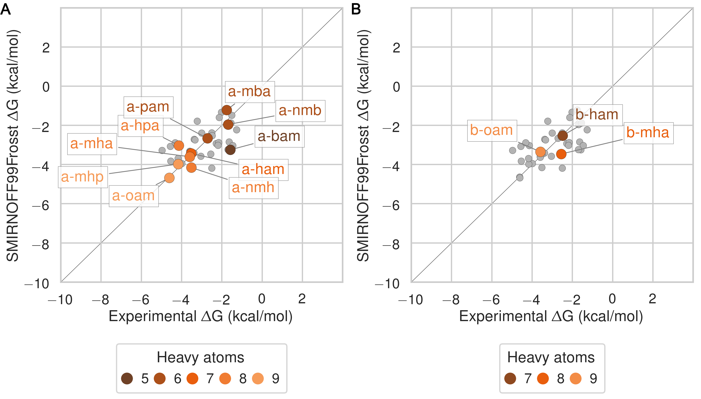
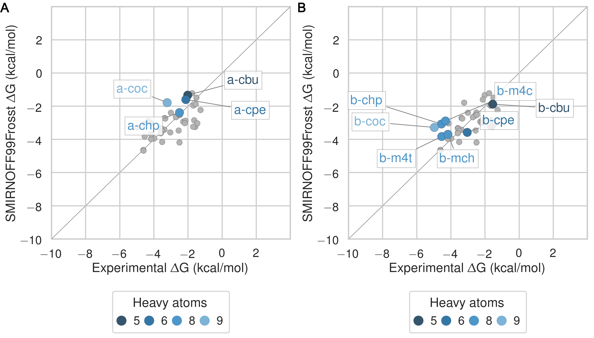
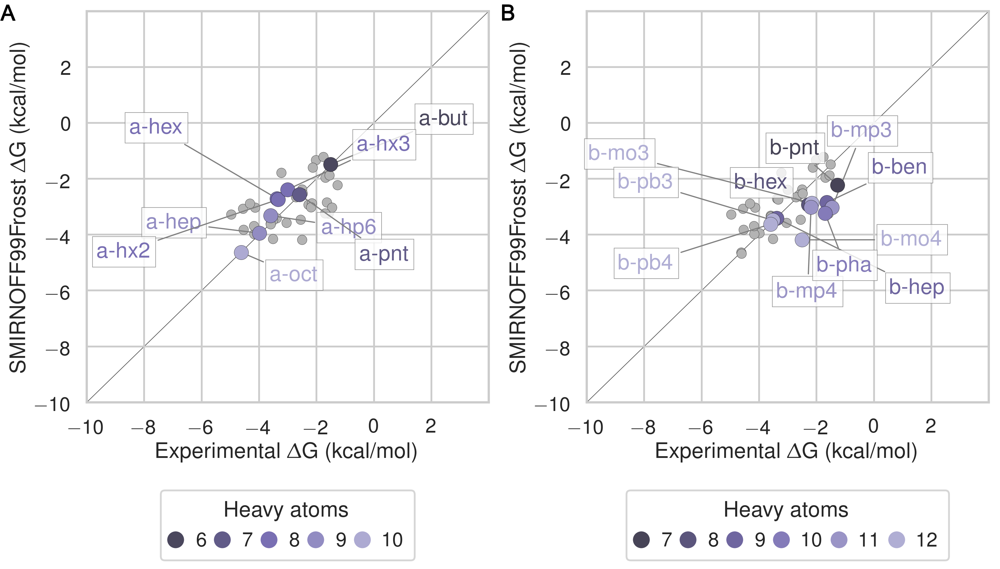
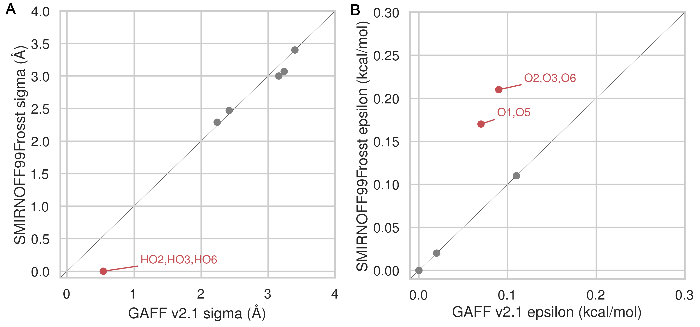
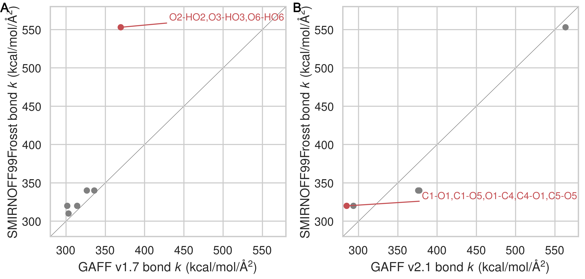
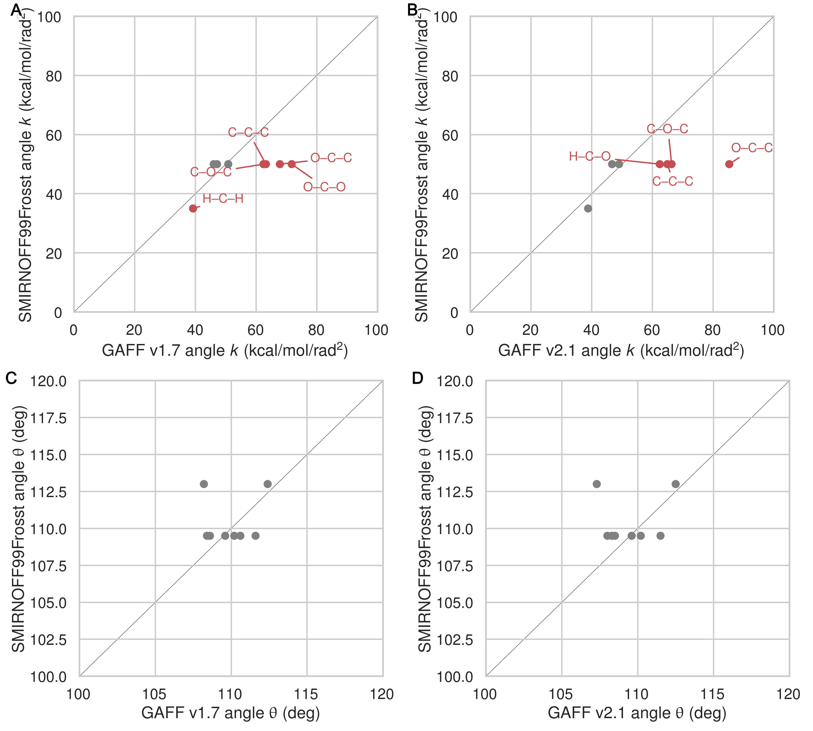
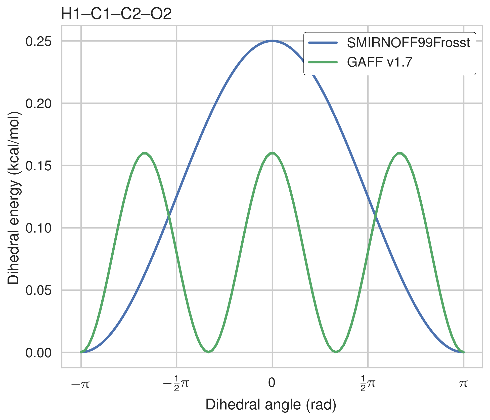

## Results

This results section is organized as follows. We first present a comparison of SMIRNOFF99Frosst and two iterations of the General AMBER Force Field (GAFF [@doi:10.1002/jcc.20035]) on predicting binding free energies (ΔG) and binding enthalpies (ΔH) of small molecule guests to α-cyclodextrin (αCD) and β-cyclodextrin (βCD). 
We then detail how the conformational preferences of guest molecules changes between force fields and finally we summarize the parameter differences between SMIRNOFF99Frosst and GAFF along with the effects of the parameter differences. 

### Comparison with experimental binding free energies, enthalpies, and entropies

#### Binding free energies

Despite having far fewer numerical parameters, SMIRNOFF99Frosst does about as well as GAFF v1.7 and better than GAFF v2.1 on predicting ΔG compared to values measured using ITC or NMR.
SMIRNOFF99Frosst has an overall deviation from experiment of 0.91 kcal/mol, 95% CI [0.71, 1.13] on binding free energies across the 43 host-guest systems, compared to 0.88 kcal/mol, 95% CI [0.71, 1.08] for GAFF v1.7 and 1.68 kcal/mol, 95% CI [1.51, 1.85] for GAFF v2.1 (Figures @fig:dG-dH, @fig:TdS, Table @tbl:statistics, Table @tbl:dG-combined, Table @tbl:dH-combined, and Table @tbl:TdS-combined)
On the whole, GAFF v1.7 agrees well with SMIRNOFF99Frosst (Figure @fig:dG-by-orientation); the overall root mean squared error (RMSE) and mean signed error (MSE) between the methods is 0.80 kcal/mol, 95% CI [0.58, 1.04] and -0.47 kcal/mol, 95% CI [-0.67, -0.28], respectively.
Both SMIRNOFF99Frosst and GAFF v1.7 systematically underestimate the ΔG for cyclic alcohols.
GAFF v2.1 significantly overestimates the binding of all compounds by more than 1.5 kcal/mol, with a mean signed error of -1.56 kcal/mol, 95% CI [-1.74, -1.37].
Despite this, GAFF v2.1 has a strikingly strong correlation with experiment across all functional group classes.
This may be traced to differences in host conformations sampled by GAFF v2.1, which indicate a more consistently open cyclodextrin "pocket" for guests to bind (Figure @fig:flexibility).

#### Binding enthalpies and entropies

On both binding enthalpies and entropies, SMIRNOFF99Frosst and GAFF v1.7 agree reasonably well with each other (ΔH RMSE = 1.65 kcal/mol, 95% CI [1.32, 2.02], −TΔS RMSE = 1.59 kcal/mol, 95% CI [1.24, 1.96]) (Figure @fig:dG-by-orientation).
The deviations between SMIRNOFF99Frosst and GAFF v2.1 are higher for ΔH (RMSE = 2.96 kcal/mol, 95% CI [2.52, 3.42]) and lower for −TΔS (RMSE = 1.55 kcal/mol, 95% CI [1.25, 1.85])
On binding enthalpies, SMIRNOFF99Frosst agrees the best with experiment (RMSE = 1.85 kcal/mol, 95% CI [1.40, 2.29]), followed by GAFF v2.1 (RMSE = 2.21 kcal/mol, 95% CI [1.77, 2.66]), and then GAFF v1.7 (RMSE = 2.54 kcal/mol, 95% CI [2.08, 2.99]), 
In some cases, GAFF v1.7 underestimates ΔH by over 3 kcal/mol and up to 5 kcal/mol (`b-chp`).

On binding entropies, GAFF v2.1 has the lowest RMSE compared to experiment (RMSE = 1.47 kcal/mol, 95% CI [1.09, 1.99]), followed by SMIRNOFF99Frosst (RMSE = 1.90 kcal/mol, 95% CI [1.49, 2.32]), and GAFF v1.7 (RMSE = 2.21 kcal/mol, 95% CI [1.74, 2.68]) (Figure @fig:TdS).  
All force fields perform poorly predicting −TΔS for carboxylate guests. 
It is worth noting that all force fields predict a much smaller entropic component of binding for `a-coc` by 3-5 kcal/mol, which does not easily fit inside the primary cavity of cyclodextrin (Figure @fig:by-orientation).

{#fig:dG-dH}

|      |      | RMSE |      |  MSE |      |   R² |      | Slope |      | Intercept |      | 
|  ---  |  ---  |  ---  |  ---  |  ---  |  ---  |  ---  |  ---  |  ---  |  ---  |  ---  |  ---  | 
| ΔG | SMIRNOFF99Frosst | 0.91 | [0.71, 1.13] | -0.01 | [-0.29, 0.26] | 0.34 | [0.12, 0.56] | 0.49 | [0.26, 0.72] | -1.55 | [-0.80, -2.29] | 
| ΔG | GAFF v1.7 | 0.88 | [0.71, 1.08] | 0.46 | [0.23, 0.69] | 0.54 | [0.33, 0.71] | 0.69 | [0.47, 0.91] | -0.47 | [0.22, -1.16] | 
| ΔG | GAFF v2.1 | 1.68 | [1.51, 1.85] | -1.56 | [-1.74, -1.37] | 0.82 | [0.61, 0.92] | 1.19 | [0.96, 1.34] | -1.00 | [-0.52, -1.62] | 
| ΔH | SMIRNOFF99Frosst | 1.85 | [1.40, 2.30] | 0.77 | [0.26, 1.28] | 0.44 | [0.21, 0.66] | 0.85 | [0.54, 1.19] | 0.41 | [1.55, -0.50] | 
| ΔH | GAFF v1.7 | 2.54 | [2.08, 2.99] | 1.84 | [1.31, 2.37] | 0.39 | [0.17, 0.62] | 0.80 | [0.47, 1.18] | 1.36 | [2.66, 0.31] | 
| ΔH | GAFF v2.1 | 2.21 | [1.77, 2.66] | -1.64 | [-2.10, -1.20] | 0.75 | [0.57, 0.87] | 1.38 | [1.15, 1.63] | -0.69 | [0.15, -1.43] | 
| -TΔS | SMIRNOFF99Frosst | 1.90 | [1.49, 2.32] | -0.78 | [-1.29, -0.25] | 0.40 | [0.14, 0.63] | 0.90 | [0.51, 1.29] | -0.83 | [-0.34, -1.34] | 
| -TΔS | GAFF v1.7 | 2.21 | [1.74, 2.68] | -1.38 | [-1.90, -0.85] | 0.43 | [0.16, 0.68] | 0.95 | [0.54, 1.38] | -1.41 | [-0.95, -1.89] | 
| -TΔS | GAFF v2.1 | 1.47 | [1.09, 2.00] | 0.08 | [-0.35, 0.54] | 0.60 | [0.29, 0.80] | 1.14 | [0.75, 1.47] | 0.15 | [0.57, -0.27] | 

Table: Predicted thermodynamic properties for each force field relative to experiment. {#tbl:statistics}

### Guest preferences for binding in the primary or secondary cyclodextrin cavity

The asymmetry of the hosts and the guests leads to two distinct bound states for each host-guest pair: one where the primary functional group of the guest interacts with the primary alcohols of the host and a second conformation where the primary functional group of the guest interacts with the secondary alcohols (@fig:cavity).

The difference in binding free energy between either orientation (ΔΔGorientation) can be large, around ~2 kcal/mol for SMIRNOFF99Frosst and GAFF v1.7 and ~5 kcal/mol for GAFF v2.1.
SMIRNOFF99Frosst predicts the largest ΔΔGorientation for the ammonium-containing butylamine and pentylamine with αCD (@fig:by-orientation), with the primary orientation being more favorable.
GAFF v1.7 predicts a large ΔΔGorientation for the cyclic alcohols cyclooctanol and  cycloheptanol, with the secondary orientation having a more favorable ΔG.
This effect is even more apparent with GAFF v2.1 where the ΔΔGorientation for `a-chp` and `a-coc` is greater than 4 kcal/mol.
This effect is due, at least in part, to sampling challenges in the bound state for very large guests (Figure @fig:by-orientation, D), especially in the narrow primary cavity of the smaller α-cyclodextrin.

{#fig:by-orientation}

### Guest preferences for αCD and βCD

Ten guests in the data set bind both αCD and βCD.
These ten guests show different patterns of binding between the two host molecules.
For example, SMIRNOFF99Frosst underestimates the binding free energy of cyclooctanol both orientations by the same amount (Figure @fig:by-cyclodextrin).
However, despite underestimating the binding free energy of cyclobutanol for αCD by ~0.7 kcal/mol,  the binding affinity prediction for βCD is very slightly overestimated by ~0.3 kcal/mol (Table @tbl:dG-combined).
Very similar patterns are observed for GAFF v1.7 and both force fields appear to perform better overall on binding affinities to αCD compared to βCD (Figure @fig:dG-dH-by-cyclodextrin).

As is the case with the difference in binding free energy between guest orientations, the difference in binding free energy between host molecules using GAFF v2.1 is large.
There does not appear to be a clear difference in the accuracy of the predictions for αCD versus βCD (Figure @fig:dG-dH-by-cyclodextrin).

{#fig:by-cyclodextrin}

### Trends by guest functional group

SMIRNOFF99Frosst does a good job (MSE = -0.10 kcal/mol, 95% CI [-0.54, 0.30] and RMSE = 0.76 kcal/mol, 95% CI [0.43, 1.12]) estimating the binding free energy of ammonium-containing guests to both αCD and βCD (Figure @fig:ammonium and Table @tbl:overall-ammonium).
Shorter chain molecules bind less strongly and the same guest binds more strongly to αCD than βCD.

{#fig:ammonium}

SMIRNOFF99Frosst performs reasonably on cyclic alcohols (MSE = 0.70 kcal/mol, 95% CI [0.22, 1.21] and RMSE = 1.07 kcal/mol, 95% CI [0.66, 1.58]) (Figure @fig:alcohols and Table @tbl:overall-alcohols).
The predictions for αCD are uniformly underestimated while those for βCD are mostly under-predicted.
The predicted ΔG for cyclooctanol with αCD is particularly poor due to a poor fit in the bound state (Figure @fig:by-orientation).

[Should say something here about cylooctanol predictions *and* experiment being poor because it does not fit well, especially in αCD]{.banner .lightgrey}

{#fig:alcohols}

The binding affinity of carboxylate guests to both αCD and βCD is well characterized by SMIRNOFF99Frosst (MSE = -0.36 kcal/mol, 95% CI [-0.73, -0.01] and RMSE = 0.87 kcal/mol, 95% CI [0.58, 1.16]) (Figure @fig:carboxylates and Table @tbl:overall-carboxylates).

{#fig:carboxylates}

In all cases, GAFF v1.7 tends to predict slightly weaker binding than SMIRNOFF99Frosst whereas GAFF v2.1 predicts much stronger binding for these compounds (Figures @fig:additional-highlights-ammonium, @fig:additional-highlights-alcohols, and @fig:additional-highlights-carboxylates).

### Differences in force field parameters between SMIRNOFF99Frosst and GAFF

Next, we summarize the parameter differences among SMIRNOFF99Frosst, a descendant of parm99; GAFF v1.7 (released circa March 2015 according to `gaff.dat` distributed with AMBER16); and GAFF v2.1 (which is under active development) on the parameters applied to αCD.

The σ and ε parameters are identical between SMIRNOFF99Frosst and GAFF v1.7.
Note, that hydroxyl hydrogens are assigned σ = 0 Å and ε = 0 kcal/mol in both GAFF v1.7 and SMIRNOFF99Frosst v1.0.5, but later versions of SMIRNOFF99Frosst adopt [small σ and ε](https://github.com/openforcefield/smirnoff99Frosst/blob/4ca43af6241a97edb356586f3f83ac21afcdff65/smirnoff99Frosst/smirnoff99Frosst.offxml#L315) values based on a similiar atom type in parm@Frosst [@url:https://github.com/openforcefield/smirnoff99Frosst/pull/74; @url:https://github.com/openforcefield/openforcefield/pull/101; @url:https://github.com/openforcefield/smirnoff99Frosst/issues/61].
Compared to GAFF v2.1, SMIRNOFF99Frosst has deeper well depths for oxygens and decreased σ values for the hydroxyl hydrogens (Figure @fig:LJ).

#### Lennard-Jones
{width="100%" #fig:LJ}

#### Bonded parameters

Compared to GAFF v1.7, SMIRNOFF99Frosst tends to have slightly larger bond force constants, except for the O--H hydroxyl bond force constant, which is much stronger.
In GAFF v2.1, the O--H hydroxyl bond force constant is consistent with SMIRNOFF99Frosst, but the carbon-oxygen bond constants are weaker.
Equilibrium bond lengths are very similar (Figure @fig:bond-req).

{width="100%" #fig:bonds}

#### Angle parameters

Relative to GAFF v1.7 and GAFF v2.1, SMIRNOFF99Frosst has fewer unique angle parameters applied to αCD; several distinct parameters appear to be compressed into a single force constant, around 50 kcal/mol/rad^2^ (Figure @fig:angles).
These parameters correspond to $\ce{C-C-C}$, $\ce{C-O-C}$, and $\ce{O-C-O}$ angles.
The $\ce{C-C-C}$ angles are primarily around the ring of the glucose monomer.
The $\ce{C-O-C}$ angles are both around the ring and between monomers (e.g., $\ce{C1-O1-C4}$ and $\ce{C1-O5-C5}$).
Weaker force constants for these parameters may lead to increased flexibility.

{width="100%" #fig:angles}

#### Dihedral parameters

The dihedral parameters between SMIRNOFF99Frosst and GAFF v1.7 are extremely similar (where differences occur, they are in the second or third decimal place), with the exception of the $\ce{H1-C1-C2-O2}$ parameter (Figure @fig:atom-names, GAFF atom types `h2-c3-c3-oh`, SMIRKS pattern `[#1:1]-[#6X4:2]-[#6X4:3]-[#8X2:4]`), for which SMIRNOFF99Frosst applies a dihedral with periodicity = 1 and GAFF v1.7 applies a dihedral with a periodicity of 3 (Table @tbl:S99-vs-GAFF-v1.7 and Figure @fig:dihedral).

|   |  |  |  |  |  | SMIRNOFF99Frosst | GAFF v1.7 |
| --- | --- | --- | --- | --- | --- | --- | --- |
|  Atom 1 | Atom 2 | Atom 3 | Atom 4 | Per | Phase | Height (kcal/mol) | Height (kcal/mol) |
|  H1 | C1 | C2 | O2 | 1 | 0 | 0.25 | -- |
|  H1 | C1 | C2 | O2 | 3 | 0 | 0.00 | 0.16 |

Table: Dihedral parameter differences between SMIRNOFF99Frosst and GAFF v1.7. {#tbl:S99-vs-GAFF-v1.7}

{#fig:dihedral width=3.5in}

The dihedral parameters in GAFF v2.1 differ from those in SMIRNOFF99Frosst, in a number of ways.
There are several dihedrals that have a different number of terms in either force field (Table @tbl:S99-vs-GAFF-v2.1-missing).
Partly this is due to the addition of dihedral terms with a barrier height of exactly 0.00 kcal/mol in GAFF, which are used to override wildcard parameters that might match the same atom types. 
For example, GAFF v2.1 applies a three term energy function to the atom types `c3-os-c3-c3`, whereas SMIRNOFF99Frosst employs a two term energy function for the SMIRKS pattern (`[#6X4:1]-[#6X4:2]-[#8X2H0:3]-[#6X4:4]`), but only the terms with periodicity 2 and 3 have nonzero barrier heights in GAFF v2.1.
SMIRNOFF99Frosst uses two nonzero terms to model the potential barrier for the SMIRKS pattern `[#6X4:1]-[#6X4:2]-[#8X2H1:3]-[#1:4]` yet GAFF v2.1 applies a single term with a barrier height of exactly 0.00 kcal/mol for the atom types `c3-c3-oh-ho`.

[I am considering removing this table. I think it is difficult to interpret: there are cases where things are missing, things are zero, and duplicate parameters applied to different sets of atoms and listed multiple times.]{.banner .lightgrey}

|   |  |  |  |  |  | SMIRNOFF99Frosst | GAFF v2.1 |
| --- | --- | --- | --- | --- | --- | --- | --- |
|  Atom 1 | Atom 2 | Atom 3 | Atom 4 | Per | Phase | Height (kcal/mol) | Height (kcal/mol) |
|  C1 | C2 | O2 | HO2 | 1 | 0 | 0.25 | -- |
|  C1 | C2 | O2 | HO2 | 3 | 0 | 0.16 | 0.00 |
|  C1 | O5 | C5 | C4 | 1 | 0 | -- | 0.00 |
|  C1 | O5 | C5 | C4 | 2 | 0 | 0.10 | 0.16 |
|  C1 | O5 | C5 | C4 | 3 | 0 | 0.38 | 0.24 |
|  C1 | O5 | C5 | C6 | 1 | 0 | -- | 0.00 |
|  C1 | O5 | C5 | C6 | 2 | 0 | 0.10 | 0.16 |
|  C1 | O5 | C5 | C6 | 3 | 0 | 0.38 | 0.24 |
|  C2 | C1 | O5 | C5 | 1 | 0 | -- | 0.00 |
|  C2 | C1 | O5 | C5 | 2 | 0 | 0.10 | 0.16 |
|  C2 | C1 | O5 | C5 | 3 | 0 | 0.38 | 0.24 |
|  C2 | C3 | O3 | HO3 | 1 | 0 | 0.25 | -- |
|  C2 | C3 | O3 | HO3 | 3 | 0 | 0.16 | 0.00 |
|  C5 | C6 | O6 | HO6 | 1 | 0 | 0.25 | -- |
|  C5 | C6 | O6 | HO6 | 3 | 0 | 0.16 | 0.00 |
|  H1 | C1 | C2 | O2 | 1 | 0 | 0.25 | -- |
|  H1 | C1 | C2 | O2 | 3 | 0 | 0.00 | 0.16 |
|  O1 | C1 | C2 | O2 | 1 | 0 | -- | 0.02 |
|  O1 | C1 | C2 | O2 | 2 | 0 | 1.18 | 0.00 |
|  O1 | C1 | C2 | O2 | 3 | 0 | 0.14 | 1.01 |
|  O2 | C2 | C1 | O5 | 1 | 0 | -- | 0.02 |
|  O2 | C2 | C1 | O5 | 2 | 0 | 1.18 | 0.00 |
|  O2 | C2 | C1 | O5 | 3 | 0 | 0.14 | 1.01 |
|  O5 | C5 | C6 | O6 | 1 | 0 | -- | 0.02 |
|  O5 | C5 | C6 | O6 | 2 | 0 | 1.18 | 0.00 |
|  O5 | C5 | C6 | O6 | 3 | 0 | 0.14 | 1.01 |
|  HO2 | O2 | C2 | C3 | 1 | 0 | 0.25 | -- |
|  HO2 | O2 | C2 | C3 | 3 | 0 | 0.16 | 0.00 |
|  HO3 | O3 | C3 | C4 | 1 | 0 | 0.25 | -- |
|  HO3 | O3 | C3 | C4 | 3 | 0 | 0.16 | 0.00 |

Table: Dihedral parameter differences between SMIRNOFF99Frosst and GAFF v2.1, where one dihedral has fewer or more periodicity terms than the corresponding term in the other force field. Atom names refer to @fig:atom-names. {#tbl:S99-vs-GAFF-v2.1-missing}

In other cases, SMIRNOFF99Frosst and GAFF v2.1 have disagreements on the barrier height after matching the periodicity and phase for a given dihedrals.
It is notable that GAFF v2.1 does not have drastically higher force constants for any of the dihedrals, yet GAFF v2.1 produces much more rigid structures (Table @tbl:S99-vs-GAFF-v2.1, Figure @fig:flexibility).
The dihedral differences between neighboring glucose monomers demonstrate that SMIRNOFF99Frosst, not GAFF v2.1 has higher force constants (Table @tbl:S99-vs-GAFF-v2.1-inter).

|   |  |  |  |  |  | SMIRNOFF99Frosst | GAFF v2.1 |
| --- | --- | --- | --- | --- | --- | --- | --- |
|  Atom 1 | Atom 2 | Atom 3 | Atom 4 | Per | Phase | Height (kcal/mol) | Height (kcal/mol) |
|  C1 | C2 | C3 | C4 | 1 | 0 | 0.20 | 0.11 |
|  C1 | C2 | C3 | C4 | 2 | 0 | 0.25 | 0.29 |
|  C1 | C2 | C3 | C4 | 3 | 0 | 0.18 | 0.13 |
|  C1 | C2 | C3 | O3 | 3 | 0 | 0.16 | 0.21 |
|  C1 | O5 | C5 | H5 | 3 | 0 | 0.38 | 0.34 |
|  C2 | C3 | C4 | C5 | 1 | 0 | 0.20 | 0.11 |
|  C2 | C3 | C4 | C5 | 2 | 0 | 0.25 | 0.29 |
|  C2 | C3 | C4 | C5 | 3 | 0 | 0.18 | 0.13 |
|  C3 | C4 | C5 | C6 | 1 | 0 | 0.20 | 0.11 |
|  C3 | C4 | C5 | C6 | 2 | 0 | 0.25 | 0.29 |
|  C3 | C4 | C5 | C6 | 3 | 0 | 0.18 | 0.13 |
|  C4 | C5 | C6 | O6 | 3 | 0 | 0.16 | 0.21 |
|  H1 | C1 | C2 | H2 | 3 | 0 | 0.15 | 0.16 |
|  H2 | C2 | C3 | H3 | 3 | 0 | 0.15 | 0.16 |
|  H2 | C2 | O2 | HO2 | 3 | 0 | 0.17 | 0.11 |
|  H3 | C3 | C4 | H4 | 3 | 0 | 0.15 | 0.16 |
|  H3 | C3 | O3 | HO3 | 3 | 0 | 0.17 | 0.11 |
|  H4 | C4 | C5 | H5 | 3 | 0 | 0.15 | 0.16 |
|  H5 | C5 | C6 | H61 | 3 | 0 | 0.15 | 0.16 |
|  H5 | C5 | C6 | H62 | 3 | 0 | 0.15 | 0.16 |
|  O1 | C1 | O5 | C5 | 1 | 0 | 1.35 | 0.97 |
|  O1 | C1 | O5 | C5 | 2 | 0 | 0.85 | 1.24 |
|  O1 | C1 | O5 | C5 | 3 | 0 | 0.10 | 0.00 |
|  O2 | C2 | C3 | C4 | 3 | 0 | 0.16 | 0.21 |
|  O2 | C2 | C3 | O3 | 2 | 0 | 1.18 | 1.13 |
|  O2 | C2 | C3 | O3 | 3 | 0 | 0.14 | 0.90 |
|  O3 | C3 | C4 | C5 | 3 | 0 | 0.16 | 0.21 |
|  H61 | C6 | O6 | HO6 | 3 | 0 | 0.17 | 0.11 |
|  H62 | C6 | O6 | HO6 | 3 | 0 | 0.17 | 0.11 |

Table: Dihedral barrier height differences between SMIRNOFF99Frosst and GAFF v2.1 for cases where the phase and periodicity of the energy term match but the barrier height does not. {#tbl:S99-vs-GAFF-v2.1}

|   |  |  |  |  |  |  |  |  |  |  | SMIRNOFF99Frosst | GAFF v2.1 |
| --- | --- | --- | --- | --- | --- | --- | --- | --- | --- | --- | --- | --- |
|  ID | Atom 1 | Res 1 | Atom 2 | Res 2 | Atom 3 | Res 3 | Atom 4 | Res 4 | Per | Phase | Height (kcal/mol) | Height (kcal/mol) |
|  1 | C1 | *n* | O1 | *n* | C4 | *n+1* | C3 | *n+1* | 1 | 0 | -- | 0.00 |
|   | C1 | *n* | O1 | *n* | C4 | *n+1* | C3 | *n+1* | 2 | 0 | 0.10 | 0.16 |
|   | C1 | *n* | O1 | *n* | C4 | *n+1* | C3 | *n+1* | 3 | 0 | 0.38 | 0.24 |
|  2 | C1 | *n* | O1 | *n* | C4 | *n+1* | C5 | *n+1* | 1 | 0 | -- | 0.00 |
|   | C1 | *n* | O1 | *n* | C4 | *n+1* | C5 | *n+1* | 2 | 0 | 0.10 | 0.16 |
|   | C1 | *n* | O1 | *n* | C4 | *n+1* | C5 | *n+1* | 3 | 0 | 0.38 | 0.24 |
|  3 | C2 | *n* | C1 | *n+1* | O1 | *n+1* | C4 | *n+1* | 1 | 0 | -- | 0.00 |
|   | C2 | *n* | C1 | *n+1* | O1 | *n+1* | C4 | *n+1* | 2 | 0 | 0.10 | 0.16 |
|   | C2 | *n* | C1 | *n+1* | O1 | *n+1* | C4 | *n+1* | 3 | 0 | 0.38 | 0.24 |
|  4 | O1 | *n* | C4 | *n+1* | C3 | *n+1* | O3 | *n+1* | 1 | 0 | -- | 0.02 |
|   | O1 | *n* | C4 | *n+1* | C3 | *n+1* | O3 | *n+1* | 2 | 0 | 1.18 | 0.00 |
|   | O1 | *n* | C4 | *n+1* | C3 | *n+1* | O3 | *n+1* | 3 | 0 | 0.14 | 1.01 |
|  5 | O1 | *n* | C4 | *n+1* | C5 | *n+1* | O5 | *n+1* | 1 | 0 | -- | 0.17 |
|   | O1 | *n* | C4 | *n+1* | C5 | *n+1* | O5 | *n+1* | 2 | 0 | 1.18 | 0.00 |
|   | O1 | *n* | C4 | *n+1* | C5 | *n+1* | O5 | *n+1* | 3 | 0 | 0.14 | 0.00 |

Table: Inter-residue dihedral parameter differences between SMIRNOFF99Frosst and GAFF v2.1. {#tbl:S99-vs-GAFF-v2.1-inter}

![The dihedral energy term applied to three inter-residue dihedrals in SMIRNOFF99Frosst and GAFF v2.1. The dihedral acting on atoms O1n--C4n+1--C5n+1--O5n+1 is quite significantly different, with multiple minima and and barrier heights. This dihedral partially controls the rotation of glucose monomers towards or away from the interior of the cyclodextrin cavity. Surprisingly, glucose monomers in GAFF v2.1 penetrate the open cavity much less frequently than in SMIRNOFF99Frosst, despite the lower and broader dihedral energy in GAFF v2.1. Atom names refer to Figure @fig:atom-names.](images/interdihedrals.png){width="100%" #fig:interdihedrals}

### Structural consequences of the force field parameter differences

In both SMIRNOFF99Frosst and GAFF v1.7, the average RMSD of βCD is between 2 and 2.5 Å over 43 μs of simulation. GAFF v2.1 is significanly more rigid, with an average RMSD less than 1.0 Å from the initial structure (Figure @fig:flexibility).

{#fig:flexibility width=100%}

The "flip" pseudodihedral O2n--C1n--C4n+1--O3n+1 characterizes the orientation of glucose monomers relative to their neighbors.
This dihedral is tightly distributed in GAFF v2.1, with all seven dihedrals having a Gaussian-like distribution, centered around -10 degreees (@fig:pseudodihedral,a).
In contrast, simulations with both SMIRNOFF99Frosst and GAFF v1.7 report a multipeaked distribution for the dihedral, with a small amount of spread among the individual angles. 
At any given time point, SMIRNOFF99Frosst adopts a variety of individual pseudodihedral conformations, leading to many conformations with at least one glucose monomer inside the cyclodextrin cavity and distortion of the overall shape of the host binding pocket (Figure @fig:pseudodihedral,b-c). 
Each pseudodihedral in GAFF v2.1 has a tight distribution; neighboring pseudodihedrals are negatively correlated with each other and positively correlated with the dihedrals on the opposite side of the ring (Figure @fig:pseudodihedral,d).

![(a) Population histograms of the pseudodihedral in free βCD, averaged over 43 μs, for each force field; one curve is drawn for each pseudodihedral in βCD. (b) Renderings of βCD in GAFF v1.7 which have the similar mean psuedodihedral values but very different individual pseudodihedral values. (c) Left: The timeseries of psuedodihedral values in SMIRNOFF99Frost during the `b-chp-p` simulation. The average value is drawn in grey. Right: The correlation between pseudodihedrals in the βCD ring with SMIRNOFF99Frosst. (d) The same as panel (c) except using GAFF v2.1.](images/cyclodextrin-pseudodihedral.png){#fig:pseudodihedral width=100%}
