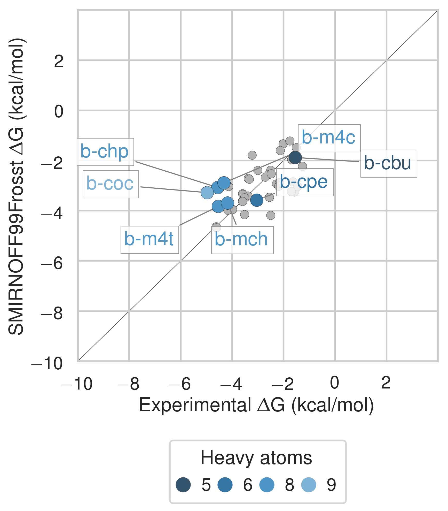

## Results

This results section is organized as follows. We first present a comparison of SMIRNOFF99Frosst and two iterations of the General AMBER Force Field (GAFF [@doi:10.1002/jcc.20035]) on predicting binding free energies (ΔG) and binding enthalpies (ΔH) of small molecule guests to α-cyclodextrin (αCD) and β-cyclodextrin (βCD). 
We then detail how the conformational preferences of guest molecules changes between force fields and finally we summarize the parameter differences between SMIRNOFF99Frosst and GAFF along with the effects of the parameter differences. 

### Comparison with experimental binding free energies, enthalpies, and entropies

Despite having far fewer numerical parameters, SMIRNOFF99Frosst does about as well as, or even better than, GAFF v1.7 on predicting ΔG and ΔH, compared to experimental values measured using ITC or NMR.
SMIRNOFF99Frosst has an overall deviation from experiment of 0.91 kcal/mol, 95% CI [0.71, 1.13] on binding free energies, 1.85 kcal/mol, 95% CI [1.40, 2.30] on binding enthalpies, and 1.87 kcal/mol, 95% CI [1.49, 2.32] on binding entropies across the 43 host-guest systems (@fig:dG-dH, @fig:TdS, Table @tbl:statistics, Table @tbl:dG-combined, Table @tbl:dH-combined, and Table @tbl:TdS-combined).
GAFF v1.7 agrees well with SMIRNOFF99Frosst (@fig:dG-by-orientation); the overall root mean squared error (RMSE) between the methods is 0.80 kcal/mol, 95% CI [0.58, 1.04].
Compared to experiment, GAFF v1.7 has RMSE values of 0.88 kcal/mol, 95% CI [0.71, 1.08], 2.54 kcal/mol, 95% CI [2.08, 2.99], and 2.21 kcal/mol, 95% CI [1.74, 2.68], on ΔG, ΔH, and −TΔS.
Both SMIRNOFF99Frosst and GAFF v1.7 systematically underestimate the ΔG and ΔH for cyclic alcohols.
In some cases, GAFF v1.7 underestimates ΔH by over 3 kcal/mol and up to 5 kcal/mol (`b-chp`).

The predictions made by GAFF v2.1 exhibit significant differences from those of SMIRNOFF99Frosst (RMSE of 1.90 kcal/mol, 95% CI [1.64, 2.17],@fig:dG-by-orientation) or GAFF v1.7 (RMSE of 2.23 kcal/mol, 95% CI [1.99, 2.46], @fig:dG-by-orientation). 
GAFF v2.1 has a large negative systematic deviation from the experimental values in both ΔG and ΔH, yet strikingly strong correlations with the experimental values across all three functional group classes.
Furthermore, GAFF v2.1 has the lowest −TΔS RMSE of any force field (@fig:TdS).
Compared to SMIRNOFF99Frosst and GAFF v1.7, GAFF v2.1 uniformly overestimates both the binding free energy and binding enthalpy, with slopes > 1 in both cases (Table @tbl:statistics).

[I'm thinking it might be cleaner and more palatable to separate the comparisions out by ΔG first, then ΔH, and then −TΔS to break things up a bit. I'm made a mush of the results, trying to touch upon the key differences without covering everything, for example, the second paragraph in this section begins by implicitly using ΔG for "agrees well" but then discusses ΔH in the final sentence.]{.banner .lightgrey} 

{ width=3.5in}
{width=3.5in}

{width=3.5in}
{width=3.5in}

{width=3.5in}
{width=3.5in}

Comparison of calculated absolute binding free energies (ΔG) and binding enthalpies (ΔH) with experiment with SMIRNOFF99Frosst parameters (top), GAFF v1.7 parameters (middle), or GAFF v2.1 parameters (bottom) applied to both host and guest. The orange, blue, and purple coloring distinguish the functional group of the guest as an ammonium, alcohol, or carboxylate, respectively.

|     |                 | RMSE |      |      | MSE  |      |      | R²   |      |      |Slope |      |      |Intercept|      |      |
| --- | ---             | ---  | ---  | ---  | ---  | ---  | ---  | ---  | ---  | ---  | ---  | ---  | ---  | ---  | ---  | ---  |
|     |                 | Mean |2.5% CI|97.5% CI|    |      |      |       |      |      |      |      |      |       |      |      |
| ΔG | SMIRNOFF99Frosst | 0.91 | 0.71 | 1.13 | -0.01 | -0.29 | 0.26 | 0.34 | 0.12 | 0.56 | 0.49 | 0.26 | 0.72 | -1.55 | -0.80 | -2.29 | 
| ΔG | GAFF v1.7 | 0.88 | 0.71 | 1.08 | 0.46 | 0.23 | 0.69 | 0.54 | 0.33 | 0.71 | 0.69 | 0.47 | 0.91 | -0.47 | 0.22 | -1.16 | 
| ΔG | GAFF v2.1 | 1.68 | 1.51 | 1.85 | -1.56 | -1.74 | -1.37 | 0.82 | 0.61 | 0.92 | 1.19 | 0.96 | 1.34 | -1.00 | -0.52 | -1.62 | 

Table: Predicted thermodynamic properties for each force field relative to experiment. {#tbl:statistics}

### Guest preferences for binding in the primary or secondary cyclodextrin cavity

The asymmetry of the hosts and the guests leads to two distinct bound states for each host-guest pair: one where the primary functional group of the guest interacts with the primary alcohols of the host and a second conformation where the primary functional group of the guest interacts with the secondary alcohols (@fig:cavity).

The difference in binding free energy between either orientation (ΔΔGorientation) can be large, around ~2 kcal/mol for SMIRNOFF99Frosst and GAFF v1.7 and ~5 kcal/mol for GAFF v2.1.
SMIRNOFF99Frosst predicts the largest ΔΔGorientation for the ammonium-containing butylamine and pentylamine with αCD (@fig:by-orientation), with the primary orientation being more favorable.
GAFF v1.7 predicts a large ΔΔGorientation for the cyclic alcohols cyclooctanol and  cycloheptanol, with the secondary orientation having a more favorable ΔG.
This effect is even more apparent with GAFF v2.1 where the ΔΔGorientation for a-chp and a-coc is greater than 4 kcal/mol.
This effect is due, at least in part, to sampling challenges in the bound state for very large guests(@fig:by-orientation, bottom right), especially in the narrow primary cavity of the smaller α-cyclodextrin.

{width=3.5in}
{width=3.5in}
{width=3.5in}
{width=2.5in}

The differences in binding free energy (ΔG) between guests in either the primary or secondary orientation of αCD or βCD. Arrows point from ΔG for the secondary to ΔG for the primary cavity. The systems are arranged in descending order by greatest difference in ΔG between orientations.
Bottom right: An overlay of cyclooctanol bound state positions (400 snapshots over 1 μs) with αCD in GAFF v2.1.

### Guest preferences for αCD and βCD

Ten guests in the data set bind both αCD and βCD.
These ten guests show different patterns of binding between the two host molecules.
For example, SMIRNOFF99Frosts underestimates the binding free energy of cyclooctanol both orientations by the same amount (@fig:by-cyclodextrin).
However, despite underestimating the binding free energy of cyclobutanol for αCD by ~0.7 kcal/mol,  the binding affinity prediction for βCD is very slightly overestimated by ~0.3 kcal/mol (Table @tbl:dG-combined).
Very similar patterns are observed for GAFF v1.7 and both force fields appear to perform better overall on binding affinities to αCD compared to βCD (@fig:dG-dH-by-cyclodextrin).

As is the case with the difference in binding free energy between guest orientations, the difference in binding free energy between host molecules using GAFF v2.1 is large.
There does not appear to be a clear difference in the accuracy of the predictions for αCD versus βCD (@fig:dG-dH-by-cyclodextrin).

{width=3.5in}
{width=3.5in}
{width=3.5in}

The differences in binding free energy between the same guest for either αCD or βCD. The binding affinity for αCD is circled in black. Thin colored lines connect data points for the same guest. Color is used purely to distinguish among the guests.

### Trends by guest functional group

SMIRNOFF99Frosst does a good job (MSE = -0.10 kcal/mol and RMSE = 0.76 kcal/mol) estimating the binding free energy of ammonium-containing guests to both αCD and βCD (@fig:ammonium).
Shorter chain molecules bind less strongly and the same guest will bind more strongly to αCD than βCD.

[I need to include the functional group tables here. I will put the SMIRNOFF99Frosst vs. Experimental tables here and the others in the SI.]{.banner .lightgrey}

{width=3.5in}
{width=3.5in}

Binding free energy (ΔG) comparisons showing ammonium guests in color and highlighted. Darker colors indicate shorter chain molecules.

SMIRNOFF99Frosst performs reasonably on cyclic alcohols (MSE = 0.70 kcal/mol and RMSE = 1.07 kcal/mol) (@fig:alcohols).
The predictions for αCD are uniformly underestimated while those for βCD are mostly under-predicted.
The predicted ΔG for cyclooctanol with αCD is particularly poor due to a poor fit in the bound state (@fig:by-orientation).

[Should say something here about cylooctanol predictions *and* experiment being poor because it does not fit well, especially in αCD]{.banner .lightgrey}

{width=3.5in}
{width=3.5in}

Binding free energy (ΔG) comparisons showing alcohols guests in color and highlighted. Darker colors indicate smaller molecules.

The binding affinity of carboxylate guests to both αCD and βCD is well characterized by SMIRNOFF99Frosst (MSE = -0.36 kcal/mol and RMSE = 0.87 kcal/mol) (@fig:carboxylates).

{width=3.5in}
{width=3.5in}

Binding free energy (ΔG) comparisons showing alcohols guests in color and highlighted. Darker colors indicates smaller molecules.

In all cases, GAFF v1.7 tends to predict slightly weaker binding than SMIRNOFF99Frosst whereas GAFF v2.1 predicts much stronger binding for these compounds (@fig:additional-highlights-ammonium, @fig:additional-highlights-alcohols, and @fig:additional-highlights-carboxylates).

### Differences in force field parameters between SMIRNOFF99Frosst and GAFF

Next, we summarize the parameter differences among SMIRNOFF99Frosst, a descendant of parm99; GAFF v1.7 (released circa March 2015 according to `gaff.dat` distributed with AMBER16); and GAFF v2.1 (which is under active development) on the parameters applied to αCD.

The σ and ε parameters are identical between SMIRNOFF99Frosst and GAFF v1.7.
Compared to GAFF v2.1, SMIRNOFF99Frosst has deeper well depths for oxygens and decreased σ values for the hydroxyl hydrogens (@fig:LJ).

#### Lennard-Jones

{width=3.5in}
{width=3.5in}

A comparison of Lennard-Jones nonbonded parameters for SMIRNOFF99Frosst and GAFF v2.1. Values that differ by more than 10% are labeled in red. Atom names refer to [@fig:atom-names]. 

#### Bonded parameters

Compared to GAFF v1.7, SMIRNOFF99Frosst tends to have slightly larger bond force constants, except for the O--H hydroxyl bond force constant, which is much stronger.
In GAFF v2.1, the O--H hydroxyl bond force constant is consistent with SMIRNOFF99Frosst, but the carbon-oxygen bond constants are weaker.
Equilibrium bond lengths are very similar ([@fig:bond-req]).

{width=3.5in}
{width=3.5in}

A comparison of bond force constants for SMIRNOFF99Frosst, GAFF v1.7, and GAFF v2.1. Values that differ by more than 10% are labeled in red. Atom names refer to [@fig:atom-names]. 

#### Angle parameters

Relative to GAFF v1.7 and GAFF v2.1, SMIRNOFF99Frosst has fewer unique angle parameters applied to αCD; several distinct parameters appear to be compressed into a single force constant, around 50 kcal/mol/rad^2^ (@fig:ang).
These parameters correspond to $\ce{C-C-C}$, $\ce{C-O-C}$, and $\ce{O-C-O}$ angles.
The $\ce{C-C-C}$ angles are primarily around the ring of the glucose monomer.
The $\ce{C-O-C}$ angles are both around the ring and between monomers (e.g., $\ce{C1-O1-C4}$ and $\ce{C1-O5-C5}$).
Weaker force constants for these parameters may lead to increased flexibility.

{width=3.5in}
{width=3.5in}

{width=3.5in}
{width=3.5in}

A comparison of angle parameters for SMIRNOFF99Frosst, GAFF v1.7, and GAFF v2.1. Values that differ by more than 10% are labeled in red. Precise atom names have been omitted to compress multiple angles with the same parameter values into a single label.

#### Dihedral parameters

The dihedral parameters between SMIRNOFF99Frosst and GAFF v1.7 are extremely similar (where differences occur, they are in the second or third decimal place), with the exception of the $\ce{H1-C1-C2-O2}$ parameter, for which SMIRNOFF99Frosst applies a dihedral with periodicity = 1 and GAFF v1.7 applies a dihedral with a periodicity of 3 (Table @tbl:S99-vs-GAFF-v1.7 and @fig:dihedral).

|   |  |  |  |  |  | SMIRNOFF99Frosst | GAFF v1.7 |
| --- | --- | --- | --- | --- | --- | --- | --- |
|  Atom 1 | Atom 2 | Atom 3 | Atom 4 | Per | Phase | Height (kcal/mol) | Height (kcal/mol) |
|  H1 | C1 | C2 | O2 | 1 | 0 | 0.25 | -- |
|  H1 | C1 | C2 | O2 | 3 | 0 | 0.00 | 0.16 |

Table: Dihedral parameter differences between SMIRNOFF99Frosst and GAFF v1.7. {#tbl:S99-vs-GAFF-v1.7}

![The dihedral energy term applied to H1-C1-C2-O2 in SMIRNOFF99Frosst and GAFF v1.7. Atom names refer to [@fig:atom-names].](images/SMIRNOFF99Frosst-vs-GAFF-v1.7-H1-C2-C2-O2.png){#fig:dihedral width=3.5in}

The dihedral parameters in GAFF v2.1 differ from those in SMIRNOFF99Frosst, in a number of ways.
There are several dihedrals that have a different number of terms in either force field (Table @tbl:S99-vs-GAFF-v2.1-missing).

[While this table is accurate, it might not be the best representation because some missing terms happen to correspond to a 0.00 kcal/mol force constant in GAFF v2.1. It might be more useful to exclude those.]{.banner .lightgrey}

|   |  |  |  |  |  | SMIRNOFF99Frosst | GAFF v2.1 |
| --- | --- | --- | --- | --- | --- | --- | --- |
|  Atom 1 | Atom 2 | Atom 3 | Atom 4 | Per | Phase | Height (kcal/mol) | Height (kcal/mol) |
|  C1 | C2 | O2 | HO2 | 1 | 0 | 0.25 | -- |
|  C1 | C2 | O2 | HO2 | 3 | 0 | 0.16 | 0.00 |
|  C1 | O5 | C5 | C4 | 1 | 0 | -- | 0.00 |
|  C1 | O5 | C5 | C4 | 2 | 0 | 0.10 | 0.16 |
|  C1 | O5 | C5 | C4 | 3 | 0 | 0.38 | 0.24 |
|  C1 | O5 | C5 | C6 | 1 | 0 | -- | 0.00 |
|  C1 | O5 | C5 | C6 | 2 | 0 | 0.10 | 0.16 |
|  C1 | O5 | C5 | C6 | 3 | 0 | 0.38 | 0.24 |
|  C2 | C1 | O5 | C5 | 1 | 0 | -- | 0.00 |
|  C2 | C1 | O5 | C5 | 2 | 0 | 0.10 | 0.16 |
|  C2 | C1 | O5 | C5 | 3 | 0 | 0.38 | 0.24 |
|  C2 | C3 | O3 | HO3 | 1 | 0 | 0.25 | -- |
|  C2 | C3 | O3 | HO3 | 3 | 0 | 0.16 | 0.00 |
|  C5 | C6 | O6 | HO6 | 1 | 0 | 0.25 | -- |
|  C5 | C6 | O6 | HO6 | 3 | 0 | 0.16 | 0.00 |
|  H1 | C1 | C2 | O2 | 1 | 0 | 0.25 | -- |
|  H1 | C1 | C2 | O2 | 3 | 0 | 0.00 | 0.16 |
|  O1 | C1 | C2 | O2 | 1 | 0 | -- | 0.02 |
|  O1 | C1 | C2 | O2 | 2 | 0 | 1.18 | 0.00 |
|  O1 | C1 | C2 | O2 | 3 | 0 | 0.14 | 1.01 |
|  O2 | C2 | C1 | O5 | 1 | 0 | -- | 0.02 |
|  O2 | C2 | C1 | O5 | 2 | 0 | 1.18 | 0.00 |
|  O2 | C2 | C1 | O5 | 3 | 0 | 0.14 | 1.01 |
|  O5 | C5 | C6 | O6 | 1 | 0 | -- | 0.02 |
|  O5 | C5 | C6 | O6 | 2 | 0 | 1.18 | 0.00 |
|  O5 | C5 | C6 | O6 | 3 | 0 | 0.14 | 1.01 |
|  HO2 | O2 | C2 | C3 | 1 | 0 | 0.25 | -- |
|  HO2 | O2 | C2 | C3 | 3 | 0 | 0.16 | 0.00 |
|  HO3 | O3 | C3 | C4 | 1 | 0 | 0.25 | -- |
|  HO3 | O3 | C3 | C4 | 3 | 0 | 0.16 | 0.00 |

Table: Dihedral parameter differences between SMIRNOFF99Frosst and GAFF v2.1, where one dihedral has fewer or more periodicity terms than the corresponding term in the other force field. {#tbl:S99-vs-GAFF-v2.1-missing}

In other cases, SMIRNOFF99Frosst and GAFF v2.1 have disagreements on the barrier height after matching the periodicity and phase for a given dihedrals.
It is notable that GAFF v2.1 does not have drastically higher force constants for any of the dihedrals, yet GAFF v2.1 produces much more rigid structures (Table @tbl:S99-vs-GAFF-v2.1, @fig:flexibility).
The dihedral differences between neighboring glucose monomers demonstrate that SMIRNOFF99Frosst, not GAFF v2.1 has higher force constants (Table @tbl:S99-vs-GAFF-v2.1-inter).

|   |  |  |  |  |  | SMIRNOFF99Frosst | GAFF v2.1 |
| --- | --- | --- | --- | --- | --- | --- | --- |
|  Atom 1 | Atom 2 | Atom 3 | Atom 4 | Per | Phase | Height (kcal/mol) | Height (kcal/mol) |
|  C1 | C2 | C3 | C4 | 1 | 0 | 0.20 | 0.11 |
|  C1 | C2 | C3 | C4 | 2 | 0 | 0.25 | 0.29 |
|  C1 | C2 | C3 | C4 | 3 | 0 | 0.18 | 0.13 |
|  C1 | C2 | C3 | O3 | 3 | 0 | 0.16 | 0.21 |
|  C1 | O5 | C5 | H5 | 3 | 0 | 0.38 | 0.34 |
|  C2 | C3 | C4 | C5 | 1 | 0 | 0.20 | 0.11 |
|  C2 | C3 | C4 | C5 | 2 | 0 | 0.25 | 0.29 |
|  C2 | C3 | C4 | C5 | 3 | 0 | 0.18 | 0.13 |
|  C3 | C4 | C5 | C6 | 1 | 0 | 0.20 | 0.11 |
|  C3 | C4 | C5 | C6 | 2 | 0 | 0.25 | 0.29 |
|  C3 | C4 | C5 | C6 | 3 | 0 | 0.18 | 0.13 |
|  C4 | C5 | C6 | O6 | 3 | 0 | 0.16 | 0.21 |
|  H1 | C1 | C2 | H2 | 3 | 0 | 0.15 | 0.16 |
|  H2 | C2 | C3 | H3 | 3 | 0 | 0.15 | 0.16 |
|  H2 | C2 | O2 | HO2 | 3 | 0 | 0.17 | 0.11 |
|  H3 | C3 | C4 | H4 | 3 | 0 | 0.15 | 0.16 |
|  H3 | C3 | O3 | HO3 | 3 | 0 | 0.17 | 0.11 |
|  H4 | C4 | C5 | H5 | 3 | 0 | 0.15 | 0.16 |
|  H5 | C5 | C6 | H61 | 3 | 0 | 0.15 | 0.16 |
|  H5 | C5 | C6 | H62 | 3 | 0 | 0.15 | 0.16 |
|  O1 | C1 | O5 | C5 | 1 | 0 | 1.35 | 0.97 |
|  O1 | C1 | O5 | C5 | 2 | 0 | 0.85 | 1.24 |
|  O1 | C1 | O5 | C5 | 3 | 0 | 0.10 | 0.00 |
|  O2 | C2 | C3 | C4 | 3 | 0 | 0.16 | 0.21 |
|  O2 | C2 | C3 | O3 | 2 | 0 | 1.18 | 1.13 |
|  O2 | C2 | C3 | O3 | 3 | 0 | 0.14 | 0.90 |
|  O3 | C3 | C4 | C5 | 3 | 0 | 0.16 | 0.21 |
|  H61 | C6 | O6 | HO6 | 3 | 0 | 0.17 | 0.11 |
|  H62 | C6 | O6 | HO6 | 3 | 0 | 0.17 | 0.11 |

Table: Dihedral parameter differences between SMIRNOFF99Frosst and GAFF v2.1, only height differences. {#tbl:S99-vs-GAFF-v2.1}

|   |  |  |  |  |  |  |  |  |  |  | SMIRNOFF99Frosst | GAFF v2.1 |
| --- | --- | --- | --- | --- | --- | --- | --- | --- | --- | --- | --- | --- |
|  ID | Atom 1 | Res 1 | Atom 2 | Res 2 | Atom 3 | Res 3 | Atom 4 | Res 4 | Per | Phase | Height (kcal/mol) | Height (kcal/mol) |
|  1 | C1 | *n* | O1 | *n* | C4 | *n+1* | C3 | *n+1* | 1 | 0 | -- | 0.00 |
|   | C1 | *n* | O1 | *n* | C4 | *n+1* | C3 | *n+1* | 2 | 0 | 0.10 | 0.16 |
|   | C1 | *n* | O1 | *n* | C4 | *n+1* | C3 | *n+1* | 3 | 0 | 0.38 | 0.24 |
|  2 | C1 | *n* | O1 | *n* | C4 | *n+1* | C5 | *n+1* | 1 | 0 | -- | 0.00 |
|   | C1 | *n* | O1 | *n* | C4 | *n+1* | C5 | *n+1* | 2 | 0 | 0.10 | 0.16 |
|   | C1 | *n* | O1 | *n* | C4 | *n+1* | C5 | *n+1* | 3 | 0 | 0.38 | 0.24 |
|  3 | C2 | *n* | C1 | *n+1* | O1 | *n+1* | C4 | *n+1* | 1 | 0 | -- | 0.00 |
|   | C2 | *n* | C1 | *n+1* | O1 | *n+1* | C4 | *n+1* | 2 | 0 | 0.10 | 0.16 |
|   | C2 | *n* | C1 | *n+1* | O1 | *n+1* | C4 | *n+1* | 3 | 0 | 0.38 | 0.24 |
|  4 | O1 | *n* | C4 | *n+1* | C3 | *n+1* | O3 | *n+1* | 1 | 0 | -- | 0.02 |
|   | O1 | *n* | C4 | *n+1* | C3 | *n+1* | O3 | *n+1* | 2 | 0 | 1.18 | 0.00 |
|   | O1 | *n* | C4 | *n+1* | C3 | *n+1* | O3 | *n+1* | 3 | 0 | 0.14 | 1.01 |
|  5 | O1 | *n* | C4 | *n+1* | C5 | *n+1* | O5 | *n+1* | 1 | 0 | -- | 0.17 |
|   | O1 | *n* | C4 | *n+1* | C5 | *n+1* | O5 | *n+1* | 2 | 0 | 1.18 | 0.00 |
|   | O1 | *n* | C4 | *n+1* | C5 | *n+1* | O5 | *n+1* | 3 | 0 | 0.14 | 0.00 |

Table: Inter-residue dihedral parameter differences between SMIRNOFF99Frosst and GAFF v2.1. {#tbl:S99-vs-GAFF-v2.1-inter}

{width=3.5in}
{width=3.5in}
{width=3.5in}

The dihedral energy term applied to three inter-residue dihedrals in SMIRNOFF99Frosst and GAFF v2.1. The dihedral acting on atoms O1n--C4n+1--C5n+1--O5n+1 is quite significantly different, with multiple minima and and barrier heights. This dihedral partially controls the rotation of glucose monomers towards or away from the interior of the cyclodextrin cavity. Surprisingly, glucose monomers in GAFF v2.1 penetrate the open cavity much less frequently than in SMIRNOFF99Frosst, despite the lower and broader dihedral energy in GAFF v2.1. Atom names refer to [@fig:atom-names]. 

### Structural consequences of the force field parameter differences

In both SMIRNOFF99Frosst and GAFF v1.7, the average RMSD of βCD is between 2 and 2.5 Å over 43 μs of simulation. GAFF v2.1 is significanly more rigid, with an average RMSD less than 1.0 Å from the initial structure ([@fig:flexibility]).

{#fig:flexibility width=100%}

The "flip" pseudodihedral O2n--C1n--C4n+1--O3n+1 characterizes the orientation of glucose monomers relative to their neighbors.
This dihedral is tightly distributed in GAFF v2.1, with all seven dihedrals having a Gaussian-like distribution, centered around -10 degreees (@fig:psuedodihedral,a).
In contrast, simulations with both SMIRNOFF99Frosst and GAFF v1.7 report a multipeaked distribution for the dihedral, with a small amount of spread among the individual angles. 
At any given time point, SMIRNOFF99Frosst adopts a variety of individual pseudodihedral conformations, leading to many conformations with at least one glucose monomer inside the cyclodextrin cavity and distortion of the overall shape of the host binding pocket (@fig:psuedodihedral,b-c). 
Each pseudodihedral in GAFF v2.1 has a tight distribution; neighboring pseudodihedrals are negatively correlated with each other and positively correlated with the dihedrals on the opposite side of the ring (@fig:psuedodihedral,d).

![(a) Population histograms of the pseudodihedral in free βCD, averaged over 43 μs, for each force field; one curve is drawn for each pseudodihedral in βCD. (b) Renderings of βCD in GAFF v1.7 which have the similar mean psuedodihedral values but very different individual pseudodihedral values. (c) Left: The timeseries of psuedodihedral values in SMIRNOFF99Frost during the `b-chp-p` simulation. Right: The correlation between pseudodihedrals in the βCD ring with SMIRNOFF99Frosst. (d) The same as panel (c) except using GAFF v2.1. v2.1.](images/cyclodextrin-pseudodihedral.png){#fig:pseudodihedral width=100%}
