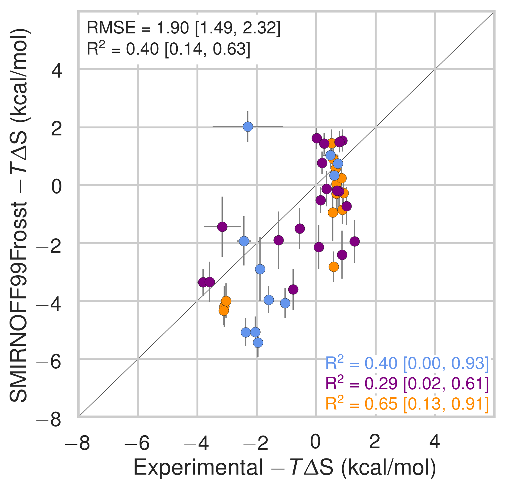
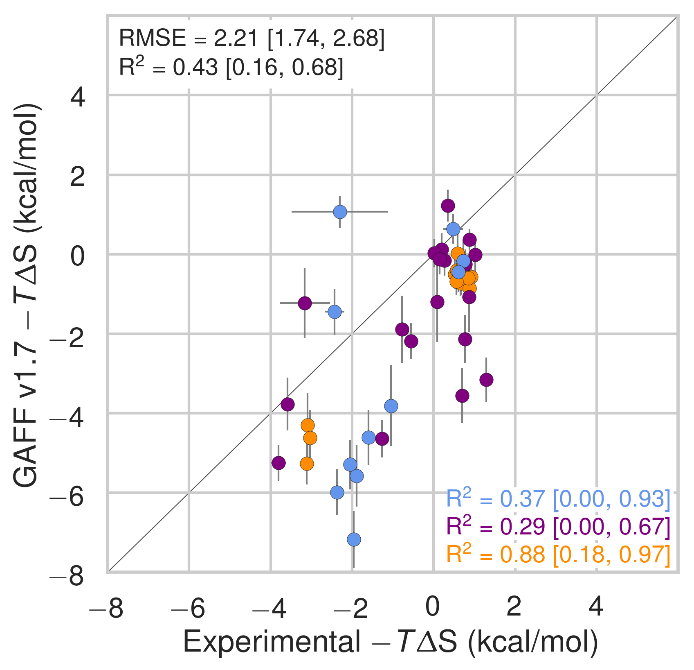
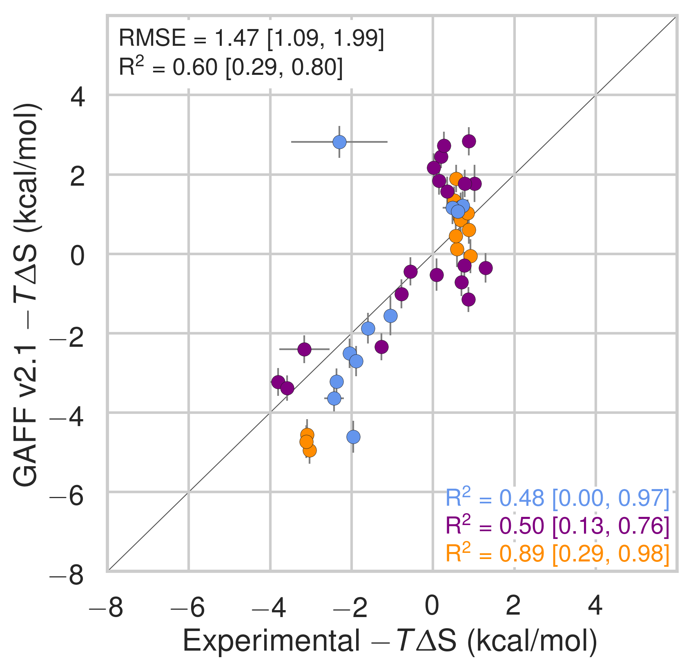
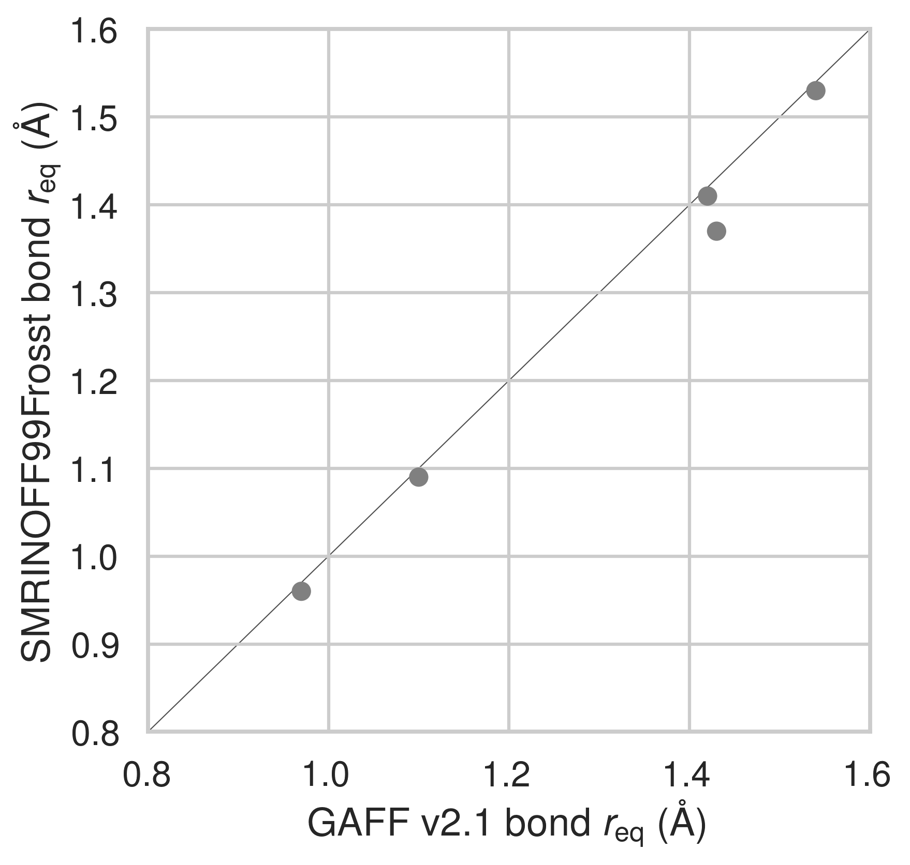

## Supporting Information {.page_break_before}

{width=3.5in}
{width=3.5in}
{width=3.5in}

Comparison of calculated absolute binding entropies (−TΔS) with experiment with SMIRNOFF99Frosst parameters (top), GAFF v1.7 parameters (middle), or GAFF v2.1 parameters (bottom) applied to both host and guest. The orange, blue, and purple coloring distinguish the functional group of the guest as an ammonium, alcohol, or carboxylate, respectively.

{width=3.5in}
{width=3.5in}

{width=3.5in}
{width=3.5in}

{width=3.5in}
{width=3.5in}

Binding free energies (ΔG) replotted from [@fig:dG-dH], with αCD points colored in blue and βCD points in grey (left) or αCD points in grey with βCD points colored in green (right).

{#fig:cyclodextrin-snapshot width=3.5in}

[Add highlights by orientation]{.banner .lightgrey}

{width=3.5in}
{width=3.5in}

A comparison of bond equilibrium lengths for SMIRNOFF99Frosst, GAFF v1.7, and GAFF v2.1. Atom names refer to [@fig:atom-names]. 

