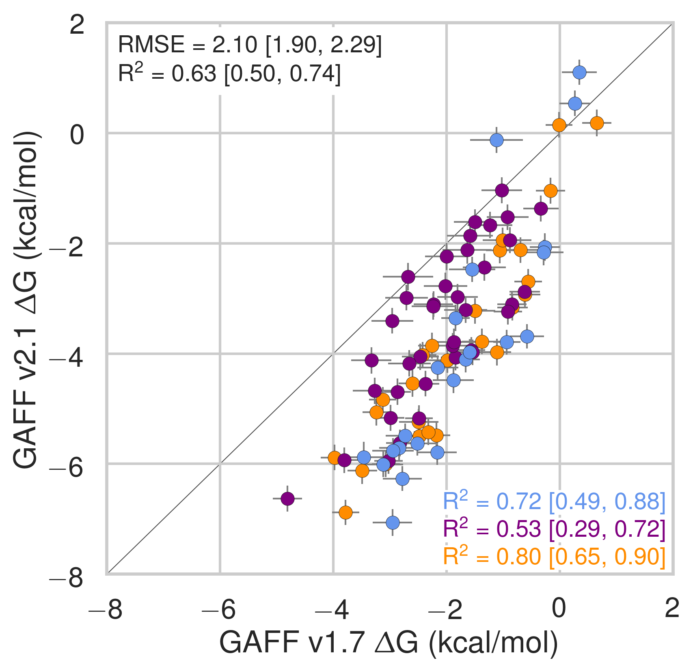

## Supporting Information {.page_break_before #SI}

{#fig:cavity width=3.5in}

{width=3.5in}
{width=3.5in}
{width=3.5in}

Comparison of calculated absolute binding entropies (−TΔS) with experiment with SMIRNOFF99Frosst parameters (top), GAFF v1.7 parameters (middle), or GAFF v2.1 parameters (bottom) applied to both host and guest. The orange, blue, and purple coloring distinguish the functional group of the guest as an ammonium, alcohol, or carboxylate, respectively.

{width=3.5in}
{width=3.5in}
{width=3.5in}

Comparison of calculated absolute binding free energies (ΔG) between force field combinations. The orange, blue, and purple coloring distinguish the functional group of the guest as an ammonium, alcohol, or carboxylate, respectively.

{width=3.5in}
{width=3.5in}
{width=3.5in}

Comparison of calculated absolute binding free enthalpies (ΔH) between force field combinations. The orange, blue, and purple coloring distinguish the functional group of the guest as an ammonium, alcohol, or carboxylate, respectively.

{width=3.5in}
{width=3.5in}
{width=3.5in}

Comparison of calculated absolute binding free entropies (-TΔS) between force field combinations. The orange, blue, and purple coloring distinguish the functional group of the guest as an ammonium, alcohol, or carboxylate, respectively.

{width=3.5in}
{width=3.5in}

{width=3.5in}
{width=3.5in}

{width=3.5in}
{width=3.5in}

Binding free energies (ΔG) replotted from [@fig:dG-dH], with αCD points colored in blue and βCD points in grey (left) or αCD points in grey with βCD points colored in green (right).

{width=3.5in}
{width=3.5in}

A comparison of bond equilibrium lengths for SMIRNOFF99Frosst, GAFF v1.7, and GAFF v2.1. Atom names refer to [@fig:atom-names]. 

{width=3.5in}
{width=3.5in}

{width=3.5in}
{width=3.5in}

Binding free energy (ΔG) comparisons showing alcohols guests in color and highlighted.

{width=3.5in}
{width=3.5in}

{width=3.5in}
{width=3.5in}

Binding free energy (ΔG) comparisons showing ammonium guests in color and highlighted.

{width=3.5in}
{width=3.5in}

{width=3.5in}
{width=3.5in}

Binding free energy (ΔG) comparisons showing carboxylates guests in color and highlighted.

|  System | Experimental |  | SMIRNOFF99Frosst |  | GAFF v1.7 |  | GAFF v2.1 |  |
| --- | --- | --- | --- | --- | --- | --- | --- | --- |
|   | Mean | SEM | Mean | SEM | Mean | SEM | Mean | SEM |
|  a-bam | -1.58 | 0.02 | -3.25 | 0.44 | -0.82 | 0.21 | -2.93 | 0.23 |
|  a-but | -1.51 | 0.04 | -1.49 | 0.27 | -1.09 | 0.20 | -3.14 | 0.22 |
|  a-cbu | -2.02 | 0.02 | -1.33 | 0.19 | -0.89 | 0.22 | -3.73 | 0.21 |
|  a-chp | -2.51 | 0.06 | -2.38 | 0.28 | -1.69 | 0.24 | -4.11 | 0.23 |
|  a-coc | -3.23 | 1.14 | -1.78 | 0.29 | -1.86 | 0.24 | -3.35 | 0.24 |
|  a-cpe | -2.13 | 0.02 | -1.59 | 0.25 | -1.50 | 0.29 | -3.79 | 0.22 |
|  a-ham | -3.53 | 0.00 | -3.43 | 0.30 | -3.02 | 0.19 | -5.99 | 0.17 |
|  a-hep | -3.99 | 0.01 | -3.95 | 0.21 | -3.93 | 0.20 | -6.23 | 0.17 |
|  a-hex | -3.38 | 0.01 | -2.70 | 0.21 | -2.92 | 0.21 | -5.27 | 0.20 |
|  a-hp6 | -3.60 | 0.00 | -3.32 | 0.23 | -3.37 | 0.18 | -5.41 | 0.18 |
|  a-hpa | -4.14 | 0.00 | -3.02 | 0.32 | -3.16 | 0.22 | -6.03 | 0.22 |
|  a-hx2 | -3.34 | 0.01 | -2.74 | 0.20 | -2.60 | 0.19 | -4.79 | 0.18 |
|  a-hx3 | -3.01 | 0.01 | -2.39 | 0.25 | -1.58 | 0.23 | -3.94 | 0.23 |
|  a-mba | -1.76 | 0.02 | -1.22 | 0.30 | -0.89 | 0.25 | -3.17 | 0.23 |
|  a-mha | -3.60 | 0.00 | -3.60 | 0.29 | -2.89 | 0.17 | -5.55 | 0.22 |
|  a-mhp | -4.17 | 0.00 | -3.98 | 0.29 | -3.82 | 0.19 | -6.23 | 0.21 |
|  a-nmb | -1.69 | 0.02 | -1.95 | 0.42 | -0.83 | 0.18 | -2.74 | 0.21 |
|  a-nmh | -3.52 | 0.01 | -4.15 | 0.59 | -2.92 | 0.18 | -5.56 | 0.19 |
|  a-oam | -4.61 | 0.01 | -4.68 | 0.49 | -4.33 | 0.17 | -6.99 | 0.19 |
|  a-oct | -4.62 | 0.02 | -4.64 | 0.30 | -4.85 | 0.24 | -6.81 | 0.19 |
|  a-pam | -2.72 | 0.00 | -2.66 | 0.77 | -1.53 | 0.18 | -4.00 | 0.23 |
|  a-pnt | -2.60 | 0.01 | -2.56 | 0.23 | -1.74 | 0.19 | -4.14 | 0.19 |
|  b-ben | -1.64 | 0.02 | -2.85 | 0.62 | -1.83 | 0.29 | -2.45 | 0.17 |
|  b-cbu | -1.55 | 0.17 | -1.88 | 0.20 | -1.64 | 0.36 | -2.77 | 0.17 |
|  b-chp | -4.56 | 0.01 | -3.08 | 0.25 | -2.79 | 0.34 | -6.27 | 0.23 |
|  b-coc | -4.97 | 0.04 | -3.28 | 0.23 | -3.36 | 0.26 | -7.13 | 0.22 |
|  b-cpe | -3.05 | 0.01 | -3.57 | 0.34 | -3.55 | 0.31 | -5.93 | 0.27 |
|  b-ham | -2.49 | 0.08 | -2.52 | 0.20 | -2.01 | 0.26 | -4.14 | 0.19 |
|  b-hep | -3.39 | 0.18 | -3.41 | 0.28 | -3.34 | 0.35 | -4.15 | 0.23 |
|  b-hex | -2.28 | 0.03 | -2.93 | 0.25 | -2.47 | 0.27 | -3.59 | 0.17 |
|  b-m4c | -4.32 | 0.01 | -2.89 | 0.24 | -2.68 | 0.29 | -5.64 | 0.22 |
|  b-m4t | -4.54 | 0.01 | -3.82 | 0.19 | -3.50 | 0.26 | -6.33 | 0.17 |
|  b-mch | -4.18 | 0.01 | -3.69 | 0.22 | -3.31 | 0.26 | -6.07 | 0.17 |
|  b-mha | -2.56 | 0.07 | -3.46 | 0.24 | -2.14 | 0.28 | -4.66 | 0.18 |
|  b-mo3 | -2.16 | 0.01 | -2.87 | 0.38 | -2.73 | 0.41 | -2.79 | 0.20 |
|  b-mo4 | -2.51 | 0.01 | -4.19 | 0.41 | -3.10 | 0.31 | -3.49 | 0.21 |
|  b-mp3 | -1.46 | 0.04 | -3.03 | 0.27 | -2.48 | 0.28 | -3.00 | 0.19 |
|  b-mp4 | -2.19 | 0.01 | -3.02 | 0.32 | -2.77 | 0.34 | -3.06 | 0.21 |
|  b-oam | -3.59 | 0.12 | -3.35 | 0.28 | -2.60 | 0.30 | -5.25 | 0.23 |
|  b-pb3 | -3.52 | 0.01 | -3.49 | 0.32 | -2.87 | 0.30 | -4.58 | 0.17 |
|  b-pb4 | -3.60 | 0.02 | -3.62 | 0.33 | -3.34 | 0.35 | -4.71 | 0.23 |
|  b-pha | -1.70 | 0.05 | -3.24 | 0.31 | -2.55 | 0.29 | -3.98 | 0.19 |
|  b-pnt | -1.27 | 0.32 | -2.22 | 0.25 | -1.73 | 0.29 | -2.00 | 0.16 |

Table: Experimental and predicted binding free energies (ΔG). {#tbl:dG-combined}

|  System | Experimental |  | SMIRNOFF99Frosst |  | GAFF v1.7 |  | GAFF v2.1 |  |
| --- | --- | --- | --- | --- | --- | --- | --- | --- |
|   | Mean | SEM | Mean | SEM | Mean | SEM | Mean | SEM |
|  a-bam | -2.17 | 0.05 | -0.43 | 0.28 | -0.84 | 0.59 | -3.05 | 0.38 |
|  a-but | -2.53 | 0.12 | -0.76 | 0.59 | -1.08 | 0.37 | -4.91 | 0.42 |
|  a-cbu | -2.75 | 0.05 | -2.08 | 0.21 | -0.71 | 0.49 | -4.94 | 0.29 |
|  a-chp | -2.99 | 0.23 | -3.42 | 0.39 | -2.33 | 0.28 | -5.27 | 0.35 |
|  a-coc | -0.93 | 0.32 | -3.80 | 0.45 | -2.93 | 0.32 | -6.17 | 0.32 |
|  a-cpe | -2.74 | 0.02 | -1.93 | 0.30 | -1.06 | 0.42 | -4.86 | 0.29 |
|  a-ham | -4.19 | 0.02 | -4.02 | 0.33 | -2.33 | 0.30 | -6.91 | 0.29 |
|  a-hep | -4.19 | 0.09 | -4.72 | 0.33 | -4.05 | 0.36 | -8.68 | 0.24 |
|  a-hex | -3.40 | 0.02 | -4.33 | 0.30 | -2.95 | 0.30 | -7.43 | 0.31 |
|  a-hp6 | -4.48 | 0.02 | -4.86 | 0.31 | -3.73 | 0.21 | -8.24 | 0.31 |
|  a-hpa | -4.66 | 0.02 | -4.47 | 0.36 | -2.65 | 0.30 | -7.38 | 0.26 |
|  a-hx2 | -4.12 | 0.06 | -4.24 | 0.31 | -2.35 | 0.32 | -6.56 | 0.30 |
|  a-hx3 | -3.36 | 0.05 | -2.25 | 0.55 | -2.80 | 0.32 | -5.51 | 0.28 |
|  a-mba | -2.68 | 0.07 | -0.95 | 0.41 | -0.32 | 0.37 | -3.11 | 0.36 |
|  a-mha | -4.28 | 0.02 | -3.31 | 0.50 | -2.16 | 0.25 | -6.40 | 0.34 |
|  a-mhp | -4.74 | 0.02 | -4.89 | 0.23 | -3.41 | 0.23 | -8.12 | 0.28 |
|  a-nmb | -2.57 | 0.06 | -1.10 | 0.28 | 0.03 | 0.23 | -3.34 | 0.27 |
|  a-nmh | -4.20 | 0.08 | -4.20 | 0.48 | -2.54 | 0.24 | -6.74 | 0.30 |
|  a-oam | -5.46 | 0.03 | -4.93 | 0.28 | -3.73 | 0.33 | -8.02 | 0.28 |
|  a-oct | -4.89 | 0.03 | -6.08 | 0.21 | -4.69 | 0.29 | -9.53 | 0.30 |
|  a-pam | -3.28 | 0.02 | -1.72 | 0.61 | -0.84 | 0.28 | -4.45 | 0.33 |
|  a-pnt | -2.75 | 0.01 | -2.05 | 0.37 | -1.62 | 0.33 | -5.99 | 0.30 |
|  b-ben | -2.51 | 0.08 | -0.45 | 0.56 | -0.76 | 0.82 | -1.30 | 0.26 |
|  b-cbu | 0.88 | 0.17 | 0.05 | 0.83 | -0.19 | 0.46 | 0.87 | 0.29 |
|  b-chp | -2.96 | 0.01 | 0.88 | 0.40 | 1.82 | 0.61 | -4.39 | 0.31 |
|  b-coc | -3.92 | 0.06 | 0.80 | 0.47 | 0.45 | 0.98 | -5.57 | 0.44 |
|  b-cpe | -1.09 | 0.01 | 1.86 | 0.37 | 3.62 | 0.65 | -1.32 | 0.30 |
|  b-ham | 0.60 | 0.05 | 1.66 | 0.68 | 2.29 | 0.78 | 0.42 | 0.33 |
|  b-hep | 0.42 | 0.04 | -0.05 | 0.38 | 1.91 | 0.29 | -0.92 | 0.27 |
|  b-hex | 1.31 | 0.04 | 0.41 | 0.65 | 1.30 | 0.60 | -0.21 | 0.27 |
|  b-m4c | -2.27 | 0.01 | 2.18 | 0.48 | 2.62 | 0.55 | -3.13 | 0.30 |
|  b-m4t | -2.17 | 0.02 | 1.26 | 0.45 | 2.49 | 0.51 | -3.11 | 0.29 |
|  b-mch | -2.29 | 0.03 | -0.79 | 1.08 | 2.27 | 0.73 | -3.37 | 0.34 |
|  b-mha | 0.47 | 0.03 | 0.53 | 0.55 | 2.48 | 0.64 | 0.28 | 0.29 |
|  b-mo3 | -2.93 | 0.03 | -2.66 | 0.46 | -0.59 | 0.45 | -2.50 | 0.28 |
|  b-mo4 | -1.96 | 0.01 | -2.69 | 0.58 | -0.91 | 0.33 | -3.05 | 0.29 |
|  b-mp3 | -2.75 | 0.13 | -1.09 | 0.68 | 0.68 | 0.48 | -2.64 | 0.31 |
|  b-mp4 | -2.89 | 0.05 | -2.84 | 0.76 | 0.78 | 0.60 | -2.34 | 0.28 |
|  b-oam | -0.48 | 0.03 | 0.98 | 0.41 | 2.66 | 0.43 | -0.52 | 0.34 |
|  b-pb3 | -2.25 | 0.01 | -1.59 | 0.94 | 1.78 | 0.36 | -2.24 | 0.30 |
|  b-pb4 | -2.82 | 0.01 | -0.02 | 0.62 | -1.44 | 0.78 | -3.70 | 0.29 |
|  b-pha | -1.79 | 0.11 | -1.10 | 0.69 | -1.34 | 0.97 | -3.45 | 0.36 |
|  b-pnt | 1.89 | 0.53 | -0.79 | 1.01 | -0.51 | 0.84 | 0.40 | 0.31 |

Table: Experimental and predicted binding enthalpies (ΔH). {#tbl:dH-combined}

|  System | Experimental |  | SMIRNOFF99Frosst |  | GAFF v1.7 |  | GAFF v2.1 |  |
| --- | --- | --- | --- | --- | --- | --- | --- | --- |
|   | Mean | SEM | Mean | SEM | Mean | SEM | Mean | SEM |
|  a-bam | 0.59 | 0.05 | -2.82 | 0.53 | 0.02 | 0.63 | 0.11 | 0.45 |
|  a-but | 1.02 | 0.13 | -0.73 | 0.65 | -0.01 | 0.42 | 1.77 | 0.47 |
|  a-cbu | 0.73 | 0.05 | 0.75 | 0.28 | -0.17 | 0.54 | 1.21 | 0.36 |
|  a-chp | 0.48 | 0.24 | 1.04 | 0.48 | 0.63 | 0.37 | 1.16 | 0.41 |
|  a-coc | -2.30 | 1.18 | 2.02 | 0.53 | 1.07 | 0.40 | 2.82 | 0.40 |
|  a-cpe | 0.61 | 0.03 | 0.33 | 0.39 | -0.44 | 0.51 | 1.07 | 0.37 |
|  a-ham | 0.66 | 0.02 | 0.59 | 0.44 | -0.68 | 0.36 | 0.92 | 0.34 |
|  a-hep | 0.20 | 0.09 | 0.77 | 0.39 | 0.12 | 0.41 | 2.45 | 0.29 |
|  a-hex | 0.02 | 0.02 | 1.62 | 0.37 | 0.03 | 0.36 | 2.17 | 0.37 |
|  a-hp6 | 0.88 | 0.02 | 1.54 | 0.38 | 0.37 | 0.27 | 2.84 | 0.36 |
|  a-hpa | 0.52 | 0.02 | 1.45 | 0.48 | -0.50 | 0.37 | 1.35 | 0.34 |
|  a-hx2 | 0.78 | 0.06 | 1.49 | 0.37 | -0.25 | 0.37 | 1.77 | 0.35 |
|  a-hx3 | 0.35 | 0.05 | -0.13 | 0.61 | 1.23 | 0.40 | 1.58 | 0.36 |
|  a-mba | 0.92 | 0.07 | -0.27 | 0.51 | -0.57 | 0.44 | -0.06 | 0.43 |
|  a-mha | 0.68 | 0.02 | -0.29 | 0.58 | -0.73 | 0.30 | 0.85 | 0.40 |
|  a-mhp | 0.57 | 0.02 | 0.92 | 0.37 | -0.41 | 0.30 | 1.89 | 0.35 |
|  a-nmb | 0.88 | 0.06 | -0.85 | 0.50 | -0.86 | 0.29 | 0.61 | 0.35 |
|  a-nmh | 0.68 | 0.08 | 0.05 | 0.76 | -0.38 | 0.30 | 1.18 | 0.36 |
|  a-oam | 0.85 | 0.03 | 0.25 | 0.57 | -0.60 | 0.37 | 1.02 | 0.34 |
|  a-oct | 0.27 | 0.04 | 1.44 | 0.37 | -0.16 | 0.38 | 2.72 | 0.36 |
|  a-pam | 0.56 | 0.02 | -0.94 | 0.98 | -0.68 | 0.34 | 0.45 | 0.40 |
|  a-pnt | 0.15 | 0.01 | -0.51 | 0.43 | -0.12 | 0.38 | 1.84 | 0.36 |
|  b-ben | 0.87 | 0.08 | -2.40 | 0.83 | -1.07 | 0.87 | -1.15 | 0.31 |
|  b-cbu | -2.43 | 0.24 | -1.93 | 0.85 | -1.45 | 0.58 | -3.64 | 0.34 |
|  b-chp | -1.60 | 0.01 | -3.96 | 0.47 | -4.61 | 0.69 | -1.87 | 0.39 |
|  b-coc | -1.05 | 0.07 | -4.08 | 0.53 | -3.81 | 1.02 | -1.56 | 0.49 |
|  b-cpe | -1.96 | 0.01 | -5.43 | 0.51 | -7.17 | 0.72 | -4.60 | 0.40 |
|  b-ham | -3.09 | 0.09 | -4.19 | 0.71 | -4.29 | 0.82 | -4.56 | 0.38 |
|  b-hep | -3.81 | 0.18 | -3.36 | 0.47 | -5.25 | 0.45 | -3.23 | 0.35 |
|  b-hex | -3.59 | 0.05 | -3.34 | 0.70 | -3.77 | 0.66 | -3.38 | 0.32 |
|  b-m4c | -2.05 | 0.01 | -5.07 | 0.54 | -5.29 | 0.62 | -2.51 | 0.37 |
|  b-m4t | -2.37 | 0.02 | -5.08 | 0.49 | -5.99 | 0.57 | -3.22 | 0.33 |
|  b-mch | -1.89 | 0.03 | -2.90 | 1.10 | -5.58 | 0.78 | -2.70 | 0.38 |
|  b-mha | -3.03 | 0.08 | -4.00 | 0.60 | -4.62 | 0.69 | -4.94 | 0.34 |
|  b-mo3 | 0.77 | 0.03 | -0.20 | 0.60 | -2.14 | 0.61 | -0.29 | 0.34 |
|  b-mo4 | -0.55 | 0.01 | -1.50 | 0.71 | -2.19 | 0.46 | -0.45 | 0.36 |
|  b-mp3 | 1.29 | 0.14 | -1.94 | 0.74 | -3.16 | 0.56 | -0.35 | 0.37 |
|  b-mp4 | 0.70 | 0.05 | -0.19 | 0.83 | -3.55 | 0.69 | -0.72 | 0.35 |
|  b-oam | -3.11 | 0.12 | -4.33 | 0.50 | -5.26 | 0.53 | -4.73 | 0.41 |
|  b-pb3 | -1.27 | 0.01 | -1.90 | 0.99 | -4.64 | 0.47 | -2.34 | 0.34 |
|  b-pb4 | -0.78 | 0.02 | -3.60 | 0.71 | -1.90 | 0.85 | -1.01 | 0.37 |
|  b-pha | 0.09 | 0.12 | -2.14 | 0.76 | -1.21 | 1.01 | -0.52 | 0.41 |
|  b-pnt | -3.16 | 0.62 | -1.43 | 1.04 | -1.22 | 0.89 | -2.40 | 0.35 |

Table: Experimental and predicted binding entropies (−TΔS). {#tbl:TdS-combined}